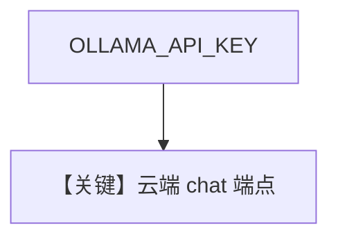

# ollama_cloud.py — 实现原理分析

> 源文件：`cookbook/90_models/ollama/chat/ollama_cloud.py`

## 概述

**Ollama Cloud**：`Ollama(id="gpt-oss:120b-cloud")`，依赖 `OLLAMA_API_KEY`，默认 host 指向云端（见模型文档）。

**核心配置一览：**

| 配置项 | 值 | 说明 |
|--------|------|------|
| `model` | `Ollama(id="gpt-oss:120b-cloud")` | 无显式 `markdown`（默认 True） |

用户消息：`"What is the capital of France?"`，`stream=True`。

## Mermaid 流程图

## 关键源码文件索引

| 文件 | 作用 |
|------|------|
| `agno/models/ollama/chat.py` | `Ollama` 客户端 host |
