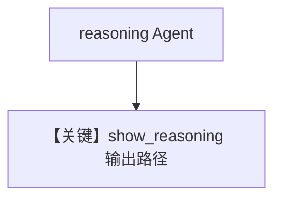

# reasoning_agent.py — 实现原理分析

<!-- cookbook-py-source:start -->
## 完整源码

```python
"""
Ollama Reasoning Agent
======================

Cookbook example for `ollama/chat/reasoning_agent.py`.
"""

from agno.agent import Agent
from agno.models.ollama import Ollama

# ---------------------------------------------------------------------------
# Create Agent
# ---------------------------------------------------------------------------

reasoning_agent = Agent(
    model=Ollama(id="gpt-oss:120b"),
    reasoning=True,
    debug_mode=True,
)

reasoning_agent.print_response(
    "How many r are in the word 'strawberry'?", show_reasoning=True
)

# ---------------------------------------------------------------------------
# Run Agent
# ---------------------------------------------------------------------------

if __name__ == "__main__":
    pass
```

<!-- cookbook-py-source:end -->

> 源文件：`cookbook/90_models/ollama/chat/reasoning_agent.py`

## 概述

**`reasoning=True` + `debug_mode=True` + `show_reasoning=True`**：展示模型推理过程（框架侧对 Ollama 的推理展示依实现而定）。

**核心配置一览：**

| 配置项 | 值 | 说明 |
|--------|------|------|
| `model` | `Ollama(id="gpt-oss:120b")` | 原生 chat |
| `reasoning` | `True` | Agent 推理标志 |
| `debug_mode` | `True` | 调试日志 |
| `show_reasoning` | `True`（在 print_response） | 输出推理 |

用户消息：`"How many r are in the word 'strawberry'?"`

## Mermaid 流程图



## 关键源码文件索引

| 文件 | 作用 |
|------|------|
| `agno/agent/agent.py` | `print_response` 与 reasoning |
