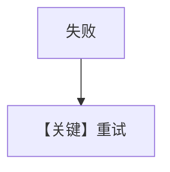

# retry.py — 实现原理分析

> 源文件：`cookbook/90_models/ollama/chat/retry.py`

## 概述

**Ollama 重试** + `ollama-wrong-id`。

**核心配置一览：**

| 配置项 | 值 | 说明 |
|--------|------|------|
| `model` | `Ollama(..., retries=3, delay_between_retries=1, exponential_backoff=True)` | 重试 |

用户消息：`"What is the capital of France?"`

## Mermaid 流程图

## 关键源码文件索引

| 文件 | 作用 |
|------|------|
| `agno/models/ollama/chat.py` | `Ollama` |
