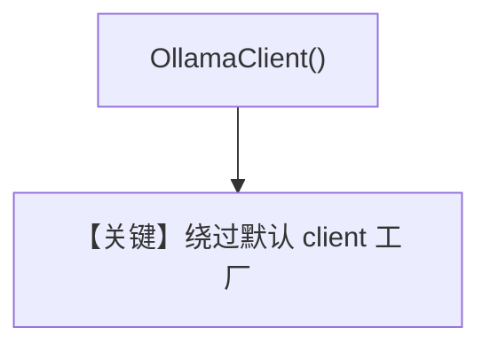

# set_client.py — 实现原理分析

> 源文件：`cookbook/90_models/ollama/chat/set_client.py`

## 概述

**注入显式 `ollama.Client`**：`Ollama(id="llama3.1:8b", client=OllamaClient())`，使用默认本地 Ollama 服务。

**核心配置一览：**

| 配置项 | 值 | 说明 |
|--------|------|------|
| `model` | `Ollama(..., client=OllamaClient())` | 自定义客户端实例 |
| `markdown` | `True` | 默认 |

## Mermaid 流程图

## 关键源码文件索引

| 文件 | 作用 |
|------|------|
| `agno/models/ollama/chat.py` | `get_client` / `client` 字段 |
