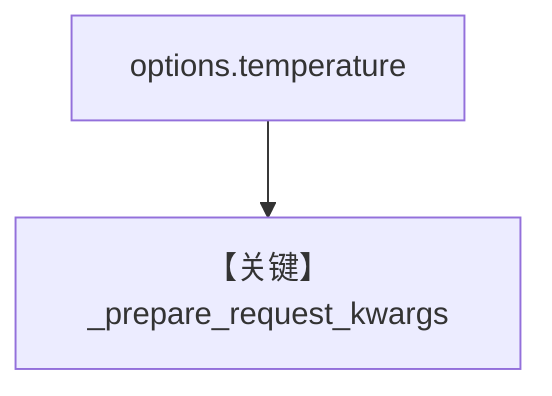

# set_temperature.py — 实现原理分析

<!-- cookbook-py-source:start -->
## 完整源码

```python
"""
Ollama Set Temperature
======================

Cookbook example for `ollama/chat/set_temperature.py`.
"""

from agno.agent import Agent, RunOutput  # noqa
from agno.models.ollama import Ollama

# ---------------------------------------------------------------------------
# Create Agent
# ---------------------------------------------------------------------------

agent = Agent(model=Ollama(id="llama3.2", options={"temperature": 0.5}), markdown=True)

# Get the response in a variable
# run: RunOutput = agent.run("Share a 2 sentence horror story")
# print(run.content)

# Print the response in the terminal
agent.print_response("Share a 2 sentence horror story")

# ---------------------------------------------------------------------------
# Run Agent
# ---------------------------------------------------------------------------

if __name__ == "__main__":
    pass
```

<!-- cookbook-py-source:end -->

> 源文件：`cookbook/90_models/ollama/chat/set_temperature.py`

## 概述

**`options={"temperature": 0.5}`** 传入 Ollama 原生请求（见 `Ollama` 对 `options` 的处理）。

**核心配置一览：**

| 配置项 | 值 | 说明 |
|--------|------|------|
| `model` | `Ollama(id="llama3.2", options={"temperature": 0.5})` | 采样参数 |
| `markdown` | `True` | 默认 |

用户消息：`"Share a 2 sentence horror story"`

## Mermaid 流程图



## 关键源码文件索引

| 文件 | 作用 |
|------|------|
| `agno/models/ollama/chat.py` | `options` 合并 |
