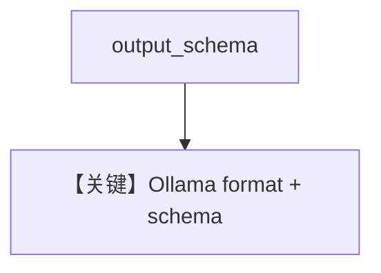

# structured_output.py — 实现原理分析

> 源文件：`cookbook/90_models/ollama/chat/structured_output.py`

## 概述

**`Ollama(id="llama3.2")` + `output_schema=MovieScript` + description**；原生 Ollama Chat 对 structured 的处理见 `Ollama._prepare_request_kwargs_for_invoke` 等。

**核心配置一览：**

| 配置项 | 值 | 说明 |
|--------|------|------|
| `model` | `Ollama(id="llama3.2")` | 原生 API |
| `description` | `"You write movie scripts."` | 字面量 |
| `output_schema` | `MovieScript` | Pydantic |

## System Prompt 组装

### description 原样

```text
You write movie scripts.
```

用户消息：`"New York"`

## Mermaid 流程图



## 关键源码文件索引

| 文件 | 作用 |
|------|------|
| `agno/models/ollama/chat.py` | `invoke` / format |
