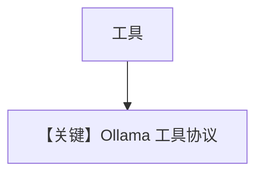

# tool_use.py — 实现原理分析

> 源文件：`cookbook/90_models/ollama/chat/tool_use.py`

## 概述

**`Ollama(id="llama3.2:latest")` + WebSearchTools**，同步与流式。

**核心配置一览：**

| 配置项 | 值 | 说明 |
|--------|------|------|
| `model` | `Ollama(id="llama3.2:latest")` | 原生 chat |
| `tools` | `[WebSearchTools()]` | 搜索 |
| `markdown` | `True` | 默认 |

用户消息：`"Whats happening in France?"`

## Mermaid 流程图

## 关键源码文件索引

| 文件 | 作用 |
|------|------|
| `agno/models/ollama/chat.py` | `invoke` |
