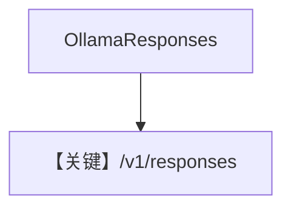

# basic.py — 实现原理分析

<!-- cookbook-py-source:start -->
## 完整源码

```python
"""Basic example using Ollama with the OpenAI Responses API.

This uses Ollama's OpenAI-compatible /v1/responses endpoint, which was added
in Ollama v0.13.3. It provides an alternative to the native Ollama API.

Requirements:
- Ollama v0.13.3 or later running locally
- Run: ollama pull llama3.1:8b
"""

import asyncio

from agno.agent import Agent
from agno.models.ollama import OllamaResponses

# ---------------------------------------------------------------------------
# Create Agent
# ---------------------------------------------------------------------------

agent = Agent(
    model=OllamaResponses(id="gpt-oss:20b"),
    markdown=True,
)

# Print the response in the terminal

# ---------------------------------------------------------------------------
# Run Agent
# ---------------------------------------------------------------------------
if __name__ == "__main__":
    # --- Sync ---
    agent.print_response("Share a 2 sentence horror story")

    # --- Sync + Streaming ---
    agent.print_response("Write a short poem about the moon", stream=True)

    # --- Async ---
    asyncio.run(agent.aprint_response("Share a 2 sentence horror story"))
```

<!-- cookbook-py-source:end -->

> 源文件：`cookbook/90_models/ollama/responses/basic.py`

## 概述

**`OllamaResponses`**：走 OpenAI **Responses API** 兼容层（`/v1/responses`），非原生 `chat()`。状态无链式 `previous_response_id`（见 `ollama/responses.py` 文档字符串）。

**核心配置一览：**

| 配置项 | 值 | 说明 |
|--------|------|------|
| `model` | `OllamaResponses(id="gpt-oss:20b")` | `OpenResponses` 子类 |
| `markdown` | `True` | 默认 |

用户消息：horror story / poem 等。

## 完整 API 请求

使用 Responses 端点（`responses.create` 形态），非 `chat.completions.create`。

## Mermaid 流程图



## 关键源码文件索引

| 文件 | 作用 |
|------|------|
| `agno/models/ollama/responses.py` | `OllamaResponses` |
| `agno/models/openai/open_responses.py` | `OpenResponses` |
