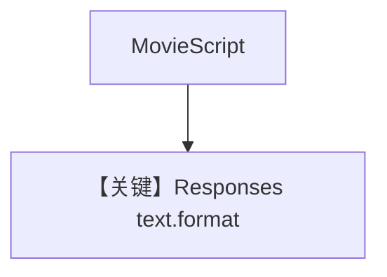

# structured_output.py — 实现原理分析

<!-- cookbook-py-source:start -->
## 完整源码

```python
"""Structured output example using Ollama with the OpenAI Responses API.

This demonstrates using Pydantic models for structured output with Ollama's
Responses API endpoint.

Requirements:
- Ollama v0.13.3 or later running locally
- Run: ollama pull llama3.1:8b
"""

from typing import List

from agno.agent import Agent
from agno.models.ollama import OllamaResponses
from pydantic import BaseModel, Field

# ---------------------------------------------------------------------------
# Create Agent
# ---------------------------------------------------------------------------


class MovieScript(BaseModel):
    name: str = Field(..., description="Give a name to this movie")
    setting: str = Field(
        ..., description="Provide a nice setting for a blockbuster movie."
    )
    ending: str = Field(
        ...,
        description="Ending of the movie. If not available, provide a happy ending.",
    )
    genre: str = Field(
        ...,
        description="Genre of the movie. If not available, select action, thriller or romantic comedy.",
    )
    characters: List[str] = Field(..., description="Name of characters for this movie.")
    storyline: str = Field(
        ..., description="3 sentence storyline for the movie. Make it exciting!"
    )


agent = Agent(
    model=OllamaResponses(id="gpt-oss:20b"),
    description="You write movie scripts.",
    output_schema=MovieScript,
)

agent.print_response("New York")

# ---------------------------------------------------------------------------
# Run Agent
# ---------------------------------------------------------------------------

if __name__ == "__main__":
    pass
```

<!-- cookbook-py-source:end -->

> 源文件：`cookbook/90_models/ollama/responses/structured_output.py`

## 概述

**`OllamaResponses` + `output_schema=MovieScript`**，Responses API 上的 JSON schema 格式。

**核心配置一览：**

| 配置项 | 值 | 说明 |
|--------|------|------|
| `model` | `OllamaResponses(id="gpt-oss:20b")` | Responses |
| `description` | `"You write movie scripts."` | 字面量 |
| `output_schema` | `MovieScript` | Pydantic |

### description 原样

```text
You write movie scripts.
```

用户消息：`"New York"`

## Mermaid 流程图



## 关键源码文件索引

| 文件 | 作用 |
|------|------|
| `agno/models/openai/responses.py` | `format` json_schema |
