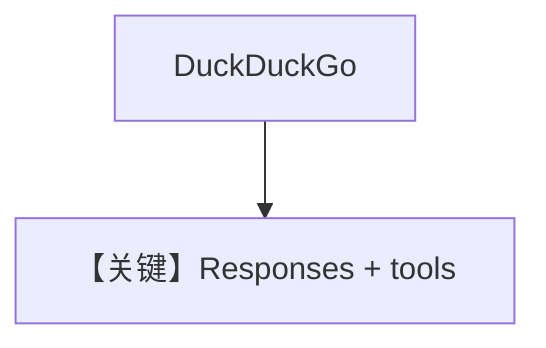

# tool_use.py — 实现原理分析

> 源文件：`cookbook/90_models/ollama/responses/tool_use.py`

## 概述

**`OllamaResponses` + DuckDuckGoTools**，Responses API 工具调用。

**核心配置一览：**

| 配置项 | 值 | 说明 |
|--------|------|------|
| `model` | `OllamaResponses(id="gpt-oss:20b")` | Responses |
| `tools` | `[DuckDuckGoTools()]` | 搜索 |
| `markdown` | `True` | 默认 |

用户消息：`"What is the latest news about AI?"`

## Mermaid 流程图

## 关键源码文件索引

| 文件 | 作用 |
|------|------|
| `agno/models/ollama/responses.py` | `OllamaResponses` |
