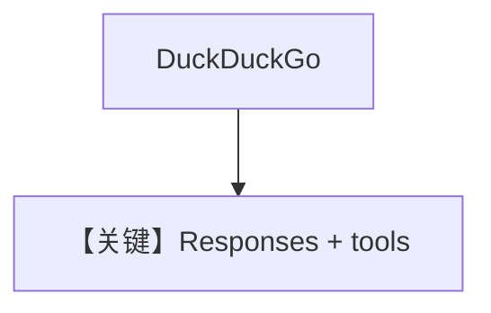

# tool_use.py — 实现原理分析

<!-- cookbook-py-source:start -->
## 完整源码

```python
"""Tool use example using Ollama with the OpenAI Responses API.

This demonstrates using tools with Ollama's Responses API endpoint.

Requirements:
- Ollama v0.13.3 or later running locally
- Run: ollama pull llama3.1:8b
"""

from agno.agent import Agent
from agno.models.ollama import OllamaResponses
from agno.tools.duckduckgo import DuckDuckGoTools

# ---------------------------------------------------------------------------
# Create Agent
# ---------------------------------------------------------------------------

agent = Agent(
    model=OllamaResponses(id="gpt-oss:20b"),
    tools=[DuckDuckGoTools()],
    markdown=True,
)

# ---------------------------------------------------------------------------
# Run Agent
# ---------------------------------------------------------------------------
if __name__ == "__main__":
    # --- Sync ---
    agent.print_response("What is the latest news about AI?")

    # --- Sync + Streaming ---
    agent.print_response("What is the latest news about AI?", stream=True)
```

<!-- cookbook-py-source:end -->

> 源文件：`cookbook/90_models/ollama/responses/tool_use.py`

## 概述

**`OllamaResponses` + DuckDuckGoTools**，Responses API 工具调用。

**核心配置一览：**

| 配置项 | 值 | 说明 |
|--------|------|------|
| `model` | `OllamaResponses(id="gpt-oss:20b")` | Responses |
| `tools` | `[DuckDuckGoTools()]` | 搜索 |
| `markdown` | `True` | 默认 |

用户消息：`"What is the latest news about AI?"`

## Mermaid 流程图



## 关键源码文件索引

| 文件 | 作用 |
|------|------|
| `agno/models/ollama/responses.py` | `OllamaResponses` |
