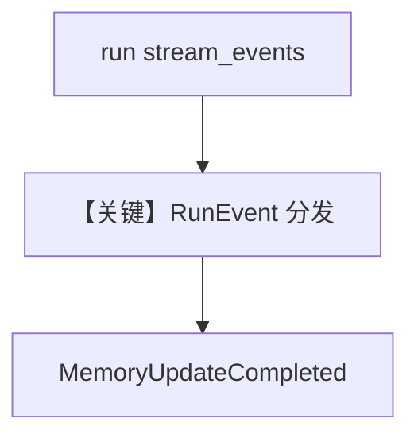

# access_memories_in_memory_completed_event.py — 实现原理分析

<!-- cookbook-py-source:start -->
## 完整源码

```python
"""
Test script to verify memory events are working correctly.
Steps:
1. Run: `./cookbook/scripts/run_pgvector.sh` to start a postgres container with pgvector
2. Run: `pip install openai sqlalchemy 'psycopg[binary]' pgvector` to install the dependencies
3. Run: `python cookbook/11_models/openai/chat/access_memories_in_memory_completed_event.py`
"""

from agno.agent import Agent
from agno.db.postgres import PostgresDb
from agno.models.openai import OpenAIChat
from agno.run.agent import RunEvent

# ---------------------------------------------------------------------------
# Create Agent
# ---------------------------------------------------------------------------

db_url = "postgresql+psycopg://ai:ai@localhost:5532/ai"
db = PostgresDb(db_url=db_url)

agent = Agent(
    model=OpenAIChat(id="gpt-5-mini"),
    user_id="test_user",
    session_id="test_session",
    db=db,
    enable_user_memories=True,
    enable_session_summaries=True,
)


def run_with_events(message: str):
    print(f"--- Query: {message} ---")

    stream = agent.run(message, stream=True, stream_events=True)

    for chunk in stream:
        if chunk.event == RunEvent.run_started.value:
            print(f"[RunStarted] model={chunk.model}")

        elif chunk.event == RunEvent.run_completed.value:
            print("[RunCompleted]")

        elif chunk.event == RunEvent.model_request_started.value:
            print(f"[ModelRequestStarted] model={chunk.model}")

        elif chunk.event == RunEvent.model_request_completed.value:
            print(
                f"[ModelRequestCompleted] tokens: in={chunk.input_tokens}, out={chunk.output_tokens}"
            )

        elif chunk.event == RunEvent.memory_update_started.value:
            print("[MemoryUpdateStarted]")

        elif chunk.event == RunEvent.memory_update_completed.value:
            print("[MemoryUpdateCompleted]")
            if chunk.memories:
                print(f"  Memories ({len(chunk.memories)}):")
                for mem in chunk.memories:
                    print(f"    - {mem.memory}")
            else:
                print("  No memories returned")

        elif chunk.event == RunEvent.session_summary_started.value:
            print("[SessionSummaryStarted]")

        elif chunk.event == RunEvent.session_summary_completed.value:
            print("[SessionSummaryCompleted]")
            if hasattr(chunk, "session_summary") and chunk.session_summary:
                print(f"  Summary: {chunk.session_summary.summary}")

        elif chunk.event == RunEvent.run_content_completed.value:
            print("[RunContentCompleted]")


# ---------------------------------------------------------------------------
# Run Agent
# ---------------------------------------------------------------------------

if __name__ == "__main__":
    run_with_events("My name is John Billings")
    run_with_events("I live in NYC")
    run_with_events("What is my name?")

    print("--- Final Memories ---")
    memories = agent.get_user_memories(user_id="test_user")
    if memories:
        for mem in memories:
            print(f"  - {mem.memory}")
    else:
        print("  No memories found")
```

<!-- cookbook-py-source:end -->

> 源文件：`cookbook/90_models/openai/chat/access_memories_in_memory_completed_event.py`

## 概述

本示例展示 **`stream_events=True` + `RunEvent` 枚举**：在流式运行中监听 `memory_update_completed`、`session_summary_completed` 等，验证记忆管线事件；**`enable_user_memories` + `enable_session_summaries` + PostgresDb**。

**核心配置一览：**

| 配置项 | 值 | 说明 |
|--------|------|------|
| `model` | `OpenAIChat(id="gpt-5-mini")` | Chat Completions |
| `db` | `PostgresDb` | 持久化 |
| `user_id` / `session_id` | `test_user` / `test_session` | 会话作用域 |
| `enable_user_memories` | `True` | 用户记忆 |
| `enable_session_summaries` | `True` | 会话摘要 |

## 核心组件解析

### 运行机制与因果链

1. `agent.run(..., stream=True, stream_events=True)` 产生事件 chunk，而非仅内容 token。
2. 记忆在 `memory_update_completed` 上可读取 `chunk.memories`。

## System Prompt 组装

随记忆写入动态变化；首轮静态不可完全还原。

用户消息示例：`"My name is John Billings"` 等。

## 完整 API 请求

底层仍为 `chat.completions`；事件层由 Agent 运行时包装。

## Mermaid 流程图



## 关键源码文件索引

| 文件 | 作用 |
|------|------|
| `agno/run/agent.py` | `RunEvent` |
| `agno/agent/agent.py` | `run` 流式事件 |
