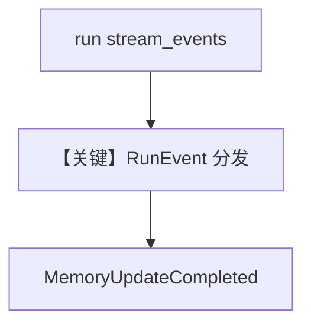

# access_memories_in_memory_completed_event.py — 实现原理分析

> 源文件：`cookbook/90_models/openai/chat/access_memories_in_memory_completed_event.py`

## 概述

本示例展示 **`stream_events=True` + `RunEvent` 枚举**：在流式运行中监听 `memory_update_completed`、`session_summary_completed` 等，验证记忆管线事件；**`enable_user_memories` + `enable_session_summaries` + PostgresDb**。

**核心配置一览：**

| 配置项 | 值 | 说明 |
|--------|------|------|
| `model` | `OpenAIChat(id="gpt-5-mini")` | Chat Completions |
| `db` | `PostgresDb` | 持久化 |
| `user_id` / `session_id` | `test_user` / `test_session` | 会话作用域 |
| `enable_user_memories` | `True` | 用户记忆 |
| `enable_session_summaries` | `True` | 会话摘要 |

## 核心组件解析

### 运行机制与因果链

1. `agent.run(..., stream=True, stream_events=True)` 产生事件 chunk，而非仅内容 token。
2. 记忆在 `memory_update_completed` 上可读取 `chunk.memories`。

## System Prompt 组装

随记忆写入动态变化；首轮静态不可完全还原。

用户消息示例：`"My name is John Billings"` 等。

## 完整 API 请求

底层仍为 `chat.completions`；事件层由 Agent 运行时包装。

## Mermaid 流程图

## 关键源码文件索引

| 文件 | 作用 |
|------|------|
| `agno/run/agent.py` | `RunEvent` |
| `agno/agent/agent.py` | `run` 流式事件 |
