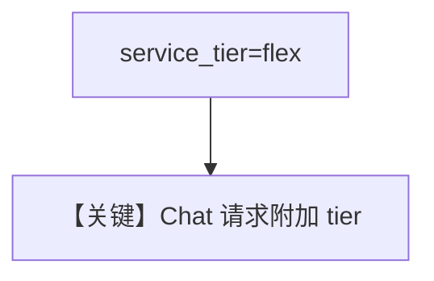

# agent_flex_tier.py — 实现原理分析

<!-- cookbook-py-source:start -->
## 完整源码

```python
"""
Openai Agent Flex Tier
======================

Cookbook example for `openai/chat/agent_flex_tier.py`.
"""

from agno.agent import Agent
from agno.models.openai import OpenAIChat

# ---------------------------------------------------------------------------
# Create Agent
# ---------------------------------------------------------------------------

agent = Agent(
    model=OpenAIChat(id="o4-mini", service_tier="flex"),
    markdown=True,
)

agent.print_response("Share a 2 sentence horror story")

# ---------------------------------------------------------------------------
# Run Agent
# ---------------------------------------------------------------------------

if __name__ == "__main__":
    pass
```

<!-- cookbook-py-source:end -->

> 源文件：`cookbook/90_models/openai/chat/agent_flex_tier.py`

## 概述

**`OpenAIChat` + `service_tier="flex"`**（OpenAI 灵活计价层级），模型 `o4-mini`。

**核心配置一览：**

| 配置项 | 值 | 说明 |
|--------|------|------|
| `model` | `OpenAIChat(id="o4-mini", service_tier="flex")` | 传入 `get_request_params` |
| `markdown` | `True` | 默认 |

用户消息：`"Share a 2 sentence horror story"`

## Mermaid 流程图



## 关键源码文件索引

| 文件 | 作用 |
|------|------|
| `agno/models/openai/chat.py` | `service_tier` |
