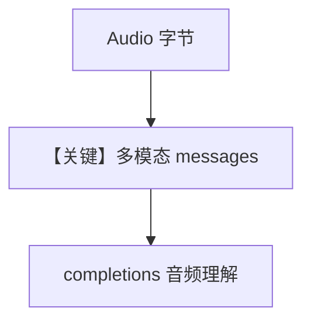

# audio_input_agent.py — 实现原理分析

> 源文件：`cookbook/90_models/openai/chat/audio_input_agent.py`

## 概述

**`gpt-4o-audio-preview` + `modalities=["text"]` + `Audio(content=wav)`**：音频作输入，文本输出，流式。

**核心配置一览：**

| 配置项 | 值 | 说明 |
|--------|------|------|
| `model` | `OpenAIChat(id="gpt-4o-audio-preview", modalities=["text"])` | 音频输入 |
| `markdown` | `True` | 默认 |

用户消息：`"What is in this audio?"` + `audio=[Audio(...)]`

## Mermaid 流程图

## 关键源码文件索引

| 文件 | 作用 |
|------|------|
| `agno/models/openai/chat.py` | `modalities` / `audio` |
