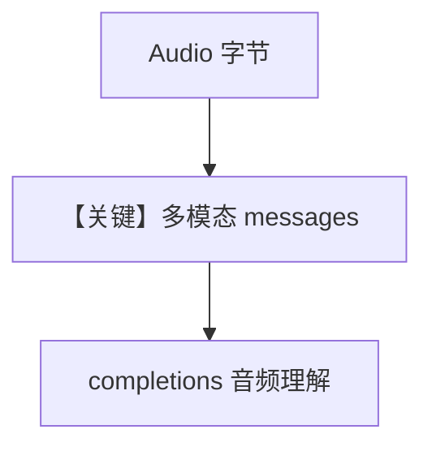

# audio_input_agent.py — 实现原理分析

<!-- cookbook-py-source:start -->
## 完整源码

```python
"""
Openai Audio Input Agent
========================

Cookbook example for `openai/chat/audio_input_agent.py`.
"""

import requests
from agno.agent import Agent, RunOutput  # noqa
from agno.media import Audio
from agno.models.openai import OpenAIChat

# ---------------------------------------------------------------------------
# Create Agent
# ---------------------------------------------------------------------------

# Fetch the audio file and convert it to a base64 encoded string
url = "https://openaiassets.blob.core.windows.net/$web/API/docs/audio/alloy.wav"
response = requests.get(url)
response.raise_for_status()
wav_data = response.content

# Provide the agent with the audio file and get result as text
agent = Agent(
    model=OpenAIChat(id="gpt-4o-audio-preview", modalities=["text"]),
    markdown=True,
)
agent.print_response(
    "What is in this audio?", audio=[Audio(content=wav_data, format="wav")], stream=True
)

# ---------------------------------------------------------------------------
# Run Agent
# ---------------------------------------------------------------------------

if __name__ == "__main__":
    pass
```

<!-- cookbook-py-source:end -->

> 源文件：`cookbook/90_models/openai/chat/audio_input_agent.py`

## 概述

**`gpt-4o-audio-preview` + `modalities=["text"]` + `Audio(content=wav)`**：音频作输入，文本输出，流式。

**核心配置一览：**

| 配置项 | 值 | 说明 |
|--------|------|------|
| `model` | `OpenAIChat(id="gpt-4o-audio-preview", modalities=["text"])` | 音频输入 |
| `markdown` | `True` | 默认 |

用户消息：`"What is in this audio?"` + `audio=[Audio(...)]`

## Mermaid 流程图



## 关键源码文件索引

| 文件 | 作用 |
|------|------|
| `agno/models/openai/chat.py` | `modalities` / `audio` |
