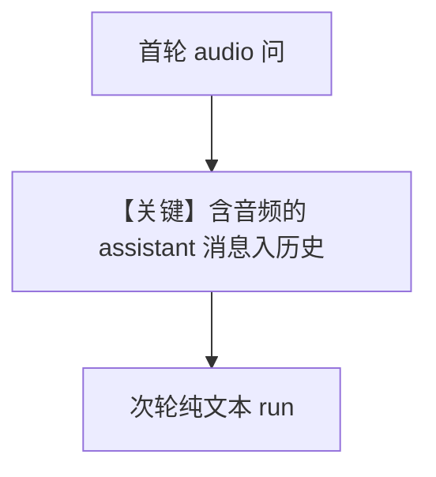

# audio_input_and_output_multi_turn.py — 实现原理分析

> 源文件：`cookbook/90_models/openai/chat/audio_input_and_output_multi_turn.py`

## 概述

**音频输入 + 音频输出**：`modalities=["text","audio"]`，`audio={"voice":"alloy","format":"wav"}`，**`add_history_to_context=True` + `num_history_runs=3`**，多轮 `run` 并将 `response_audio` 写入文件。

**核心配置一览：**

| 配置项 | 值 | 说明 |
|--------|------|------|
| `model` | `OpenAIChat(..., modalities=["text", "audio"], audio={...})` | TTS 响应 |
| `add_history_to_context` | `True` | 历史 |
| `num_history_runs` | `3` | 历史条数 |

## Mermaid 流程图

## 关键源码文件索引

| 文件 | 作用 |
|------|------|
| `agno/agent/agent.py` | `run` 多模态 |
| `agno/models/openai/chat.py` | `modalities` / `audio` |
