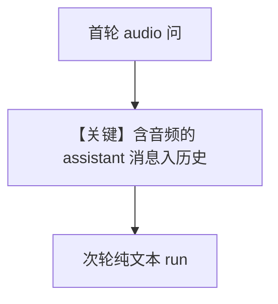

# audio_input_and_output_multi_turn.py — 实现原理分析

<!-- cookbook-py-source:start -->
## 完整源码

```python
"""
Openai Audio Input And Output Multi Turn
========================================

Cookbook example for `openai/chat/audio_input_and_output_multi_turn.py`.
"""

from pathlib import Path

import requests
from agno.agent import Agent, RunOutput  # noqa
from agno.media import Audio
from agno.models.openai import OpenAIChat
from agno.utils.audio import write_audio_to_file

# ---------------------------------------------------------------------------
# Create Agent
# ---------------------------------------------------------------------------

# Fetch the audio file and convert it to a base64 encoded string
url = "https://openaiassets.blob.core.windows.net/$web/API/docs/audio/alloy.wav"
response = requests.get(url)
response.raise_for_status()
wav_data = response.content

# Provide the agent with the audio file and audio configuration and get result as text + audio
agent = Agent(
    model=OpenAIChat(
        id="gpt-4o-audio-preview",
        modalities=["text", "audio"],
        audio={"voice": "alloy", "format": "wav"},
    ),
    # Set add_history_to_context=true to add the previous chat history to the context sent to the Model.
    add_history_to_context=True,
    # Number of historical responses to add to the messages.
    num_history_runs=3,
)
run_output: RunOutput = agent.run(
    input="What is in this audio?", audio=[Audio(content=wav_data, format="wav")]
)

filename = Path(__file__).parent.joinpath("tmp/conversation_response_1.wav")
filename.unlink(missing_ok=True)
filename.parent.mkdir(parents=True, exist_ok=True)

# Save the response audio to a file
if run_output.response_audio is not None:
    write_audio_to_file(audio=run_output.response_audio.content, filename=str(filename))

run_output: RunOutput = agent.run("Tell me something more about the audio")

filename = Path(__file__).parent.joinpath("tmp/conversation_response_2.wav")
filename.unlink(missing_ok=True)

# Save the response audio to a file
if run_output.response_audio is not None:
    write_audio_to_file(audio=run_output.response_audio.content, filename=str(filename))

run_output: RunOutput = agent.run("Now tell me a 5 second story")

filename = Path(__file__).parent.joinpath("tmp/conversation_response_3.wav")
filename.unlink(missing_ok=True)

# Save the response audio to a file
if run_output.response_audio is not None:
    write_audio_to_file(audio=run_output.response_audio.content, filename=str(filename))

# ---------------------------------------------------------------------------
# Run Agent
# ---------------------------------------------------------------------------

if __name__ == "__main__":
    pass
```

<!-- cookbook-py-source:end -->

> 源文件：`cookbook/90_models/openai/chat/audio_input_and_output_multi_turn.py`

## 概述

**音频输入 + 音频输出**：`modalities=["text","audio"]`，`audio={"voice":"alloy","format":"wav"}`，**`add_history_to_context=True` + `num_history_runs=3`**，多轮 `run` 并将 `response_audio` 写入文件。

**核心配置一览：**

| 配置项 | 值 | 说明 |
|--------|------|------|
| `model` | `OpenAIChat(..., modalities=["text", "audio"], audio={...})` | TTS 响应 |
| `add_history_to_context` | `True` | 历史 |
| `num_history_runs` | `3` | 历史条数 |

## Mermaid 流程图



## 关键源码文件索引

| 文件 | 作用 |
|------|------|
| `agno/agent/agent.py` | `run` 多模态 |
| `agno/models/openai/chat.py` | `modalities` / `audio` |
