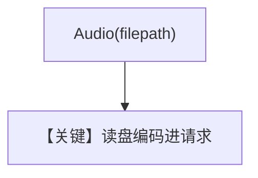

# audio_input_local_file_upload.py — 实现原理分析

> 源文件：`cookbook/90_models/openai/chat/audio_input_local_file_upload.py`

## 概述

**本地 `sample.mp3` + `Audio(filepath=..., format="mp3")`**，`gpt-4o-audio-preview` 文本模态。

**核心配置一览：**

| 配置项 | 值 | 说明 |
|--------|------|------|
| `model` | `OpenAIChat(id="gpt-4o-audio-preview", modalities=["text"])` | 音频输入 |

用户消息：`"Tell me about this audio"` + 本地文件

## Mermaid 流程图

## 关键源码文件索引

| 文件 | 作用 |
|------|------|
| `agno/media` | `Audio` |
