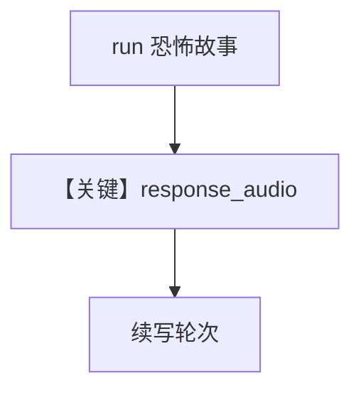

# audio_output_agent.py — 实现原理分析

<!-- cookbook-py-source:start -->
## 完整源码

```python
"""
Openai Audio Output Agent
=========================

Cookbook example for `openai/chat/audio_output_agent.py`.
"""

from agno.agent import Agent, RunOutput  # noqa
from agno.models.openai import OpenAIChat
from agno.utils.audio import write_audio_to_file
from agno.db.in_memory import InMemoryDb

# ---------------------------------------------------------------------------
# Create Agent
# ---------------------------------------------------------------------------

# Provide the agent with the audio file and audio configuration and get result as text + audio
agent = Agent(
    model=OpenAIChat(
        id="gpt-4o-audio-preview",
        modalities=["text", "audio"],
        audio={"voice": "sage", "format": "wav"},
    ),
    db=InMemoryDb(),
    add_history_to_context=True,
    markdown=True,
)
run_output: RunOutput = agent.run("Tell me a 5 second scary story")

# Save the response audio to a file
if run_output.response_audio:
    write_audio_to_file(
        audio=run_output.response_audio.content, filename="tmp/scary_story.wav"
    )

run_output: RunOutput = agent.run("What would be in a sequal of this story?")

# Save the response audio to a file
if run_output.response_audio:
    write_audio_to_file(
        audio=run_output.response_audio.content,
        filename="tmp/scary_story_sequal.wav",
    )

# ---------------------------------------------------------------------------
# Run Agent
# ---------------------------------------------------------------------------

if __name__ == "__main__":
    pass
```

<!-- cookbook-py-source:end -->

> 源文件：`cookbook/90_models/openai/chat/audio_output_agent.py`

## 概述

**文本+音频输出**，`voice=sage`，**`InMemoryDb` + `add_history_to_context`**，多轮并保存 WAV。

**核心配置一览：**

| 配置项 | 值 | 说明 |
|--------|------|------|
| `model` | `OpenAIChat(..., modalities=["text","audio"], audio={"voice":"sage","format":"wav"})` | TTS |
| `db` | `InMemoryDb()` | 会话内存 |
| `add_history_to_context` | `True` | 历史 |
| `markdown` | `True` | 默认 |

## Mermaid 流程图



## 关键源码文件索引

| 文件 | 作用 |
|------|------|
| `agno/run/agent.py` | `RunOutput.response_audio` |
