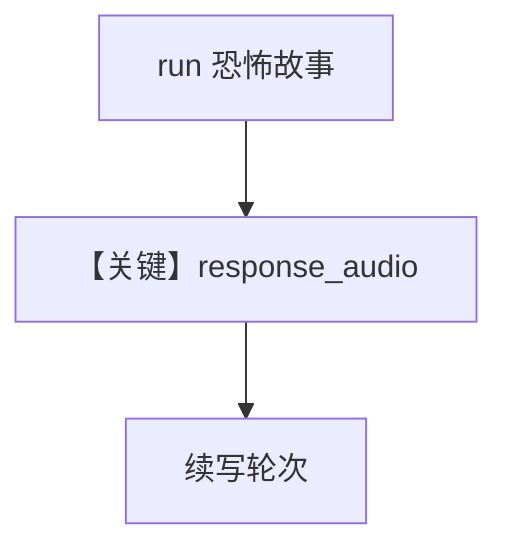

# audio_output_agent.py — 实现原理分析

> 源文件：`cookbook/90_models/openai/chat/audio_output_agent.py`

## 概述

**文本+音频输出**，`voice=sage`，**`InMemoryDb` + `add_history_to_context`**，多轮并保存 WAV。

**核心配置一览：**

| 配置项 | 值 | 说明 |
|--------|------|------|
| `model` | `OpenAIChat(..., modalities=["text","audio"], audio={"voice":"sage","format":"wav"})` | TTS |
| `db` | `InMemoryDb()` | 会话内存 |
| `add_history_to_context` | `True` | 历史 |
| `markdown` | `True` | 默认 |

## Mermaid 流程图

## 关键源码文件索引

| 文件 | 作用 |
|------|------|
| `agno/run/agent.py` | `RunOutput.response_audio` |
