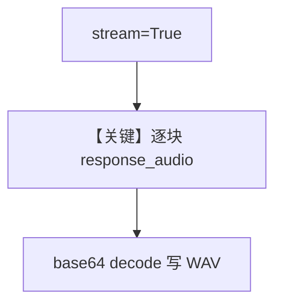

# audio_output_stream.py — 实现原理分析

> 源文件：`cookbook/90_models/openai/chat/audio_output_stream.py`

## 概述

**流式 `RunOutputEvent`** + **PCM16** + **`format="pcm16"`**（注释：流式仅支持 pcm16），边收 `response_audio` 边写 wave 文件。

**核心配置一览：**

| 配置项 | 值 | 说明 |
|--------|------|------|
| `model` | `OpenAIChat(..., audio={"voice":"alloy","format":"pcm16"})` | 流式音频 |
| `db` | `InMemoryDb()` | 会话 |

## Mermaid 流程图

## 关键源码文件索引

| 文件 | 作用 |
|------|------|
| `agno/agent/agent.py` | 流式事件 |
