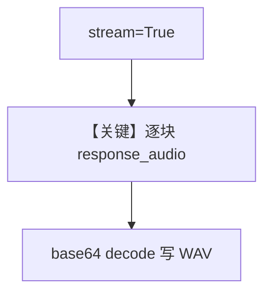

# audio_output_stream.py — 实现原理分析

<!-- cookbook-py-source:start -->
## 完整源码

```python
"""
Openai Audio Output Stream
==========================

Cookbook example for `openai/chat/audio_output_stream.py`.
"""

import base64
import wave
from typing import Iterator

from agno.agent import Agent, RunOutputEvent  # noqa
from agno.db.in_memory import InMemoryDb
from agno.models.openai import OpenAIChat

# ---------------------------------------------------------------------------
# Create Agent
# ---------------------------------------------------------------------------

# Audio Configuration
SAMPLE_RATE = 24000  # Hz (24kHz)
CHANNELS = 1  # Mono (Change to 2 if Stereo)
SAMPLE_WIDTH = 2  # Bytes (16 bits)

# Provide the agent with the audio file and audio configuration and get result as text + audio
agent = Agent(
    model=OpenAIChat(
        id="gpt-4o-audio-preview",
        modalities=["text", "audio"],
        audio={
            "voice": "alloy",
            "format": "pcm16",
        },  # Only pcm16 is supported with streaming
    ),
    db=InMemoryDb(),
)
output_stream: Iterator[RunOutputEvent] = agent.run(
    "Tell me a 10 second story", stream=True
)

filename = "tmp/response_stream.wav"

# Open the file once in append-binary mode
with wave.open(str(filename), "wb") as wav_file:
    wav_file.setnchannels(CHANNELS)
    wav_file.setsampwidth(SAMPLE_WIDTH)
    wav_file.setframerate(SAMPLE_RATE)

    # Iterate over generated audio
    for response in output_stream:
        response_audio = response.response_audio  # type: ignore
        if response_audio:
            if response_audio.transcript:
                print(response_audio.transcript, end="", flush=True)
            if response_audio.content:
                try:
                    pcm_bytes = response_audio.content
                    pcm_bytes = base64.b64decode(pcm_bytes)
                    wav_file.writeframes(pcm_bytes)
                except Exception as e:
                    print(f"Error decoding audio: {e}")
print()
print(f"Saved audio to {filename}")

print("Metrics:")
print(agent.get_last_run_output().metrics)

# ---------------------------------------------------------------------------
# Run Agent
# ---------------------------------------------------------------------------

if __name__ == "__main__":
    pass
```

<!-- cookbook-py-source:end -->

> 源文件：`cookbook/90_models/openai/chat/audio_output_stream.py`

## 概述

**流式 `RunOutputEvent`** + **PCM16** + **`format="pcm16"`**（注释：流式仅支持 pcm16），边收 `response_audio` 边写 wave 文件。

**核心配置一览：**

| 配置项 | 值 | 说明 |
|--------|------|------|
| `model` | `OpenAIChat(..., audio={"voice":"alloy","format":"pcm16"})` | 流式音频 |
| `db` | `InMemoryDb()` | 会话 |

## Mermaid 流程图



## 关键源码文件索引

| 文件 | 作用 |
|------|------|
| `agno/agent/agent.py` | 流式事件 |
