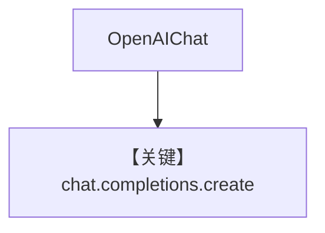

# basic.py — 实现原理分析

> 源文件：`cookbook/90_models/openai/chat/basic.py`

## 概述

**`OpenAIChat(id="gpt-4o", temperature=0.5)`** 最简调用，同步/异步与流式。

**核心配置一览：**

| 配置项 | 值 | 说明 |
|--------|------|------|
| `model` | `OpenAIChat(id="gpt-4o", temperature=0.5)` | Chat Completions |
| `markdown` | `True` | 默认 |

用户消息：`"Share a 2 sentence horror story"`

## System Prompt 组装

```text
Use markdown to format your answers.
```

## Mermaid 流程图



## 关键源码文件索引

| 文件 | 作用 |
|------|------|
| `agno/models/openai/chat.py` | `invoke` |
