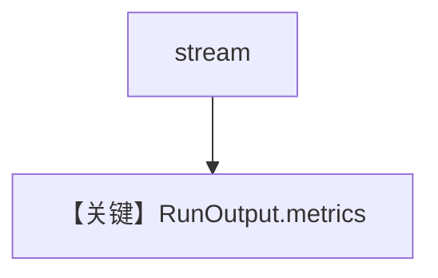

# basic_stream_metrics.py — 实现原理分析

> 源文件：`cookbook/90_models/openai/chat/basic_stream_metrics.py`

## 概述

**流式 + `InMemoryDb` + `get_last_run_output().metrics`** 与逐条 `message.metrics`。

**核心配置一览：**

| 配置项 | 值 | 说明 |
|--------|------|------|
| `model` | `OpenAIChat(id="gpt-4o")` | Chat |
| `db` | `InMemoryDb()` | 记录 run |
| `markdown` | `True` | 默认 |

## Mermaid 流程图

## 关键源码文件索引

| 文件 | 作用 |
|------|------|
| `agno/run/agent.py` | `RunOutput` |
