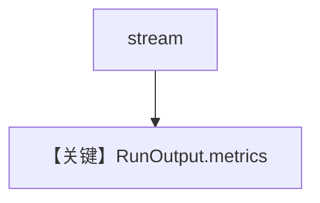

# basic_stream_metrics.py — 实现原理分析

<!-- cookbook-py-source:start -->
## 完整源码

```python
"""
Openai Basic Stream Metrics
===========================

Cookbook example for `openai/chat/basic_stream_metrics.py`.
"""

from typing import Iterator  # noqa
from agno.agent import Agent, RunOutputEvent  # noqa
from agno.models.openai import OpenAIChat
from agno.db.in_memory import InMemoryDb

# ---------------------------------------------------------------------------
# Create Agent
# ---------------------------------------------------------------------------

agent = Agent(model=OpenAIChat(id="gpt-4o"), db=InMemoryDb(), markdown=True)

# Get the response in a variable
# run_response: Iterator[RunOutputEvent] = agent.run("Share a 2 sentence horror story", stream=True)
# for chunk in run_response:
#     print(chunk.content)

# Print the response in the terminal
agent.print_response("Share a 2 sentence horror story", stream=True)

run_output = agent.get_last_run_output()
print("Metrics:")
print(run_output.metrics)

print("Message Metrics:")
for message in run_output.messages:
    if message.role == "assistant":
        print(message.role)
        print(message.metrics)

# ---------------------------------------------------------------------------
# Run Agent
# ---------------------------------------------------------------------------

if __name__ == "__main__":
    pass
```

<!-- cookbook-py-source:end -->

> 源文件：`cookbook/90_models/openai/chat/basic_stream_metrics.py`

## 概述

**流式 + `InMemoryDb` + `get_last_run_output().metrics`** 与逐条 `message.metrics`。

**核心配置一览：**

| 配置项 | 值 | 说明 |
|--------|------|------|
| `model` | `OpenAIChat(id="gpt-4o")` | Chat |
| `db` | `InMemoryDb()` | 记录 run |
| `markdown` | `True` | 默认 |

## Mermaid 流程图



## 关键源码文件索引

| 文件 | 作用 |
|------|------|
| `agno/run/agent.py` | `RunOutput` |
