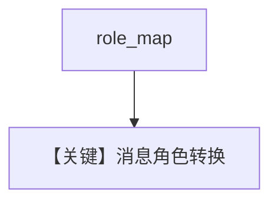

# custom_role_map.py — 实现原理分析

<!-- cookbook-py-source:start -->
## 完整源码

```python
"""This example shows how to use a custom role map with the OpenAIChat class.

This is useful when using a custom model that doesn't support the default role map.

To run this example:
- Set the MISTRAL_API_KEY environment variable.
- Run `uv pip install openai agno` to install dependencies.
"""

from os import getenv

from agno.agent import Agent
from agno.models.openai import OpenAIChat

# ---------------------------------------------------------------------------
# Create Agent
# ---------------------------------------------------------------------------

# Using these Mistral model and url as an example.
model_id = "mistral-medium-2505"
base_url = "https://api.mistral.ai/v1"
api_key = getenv("MISTRAL_API_KEY")
mistral_role_map = {
    "system": "system",
    "user": "user",
    "assistant": "assistant",
    "tool": "tool",
    "model": "assistant",
}

# When initializing the model, we pass our custom role map.
model = OpenAIChat(
    id=model_id,
    base_url=base_url,
    api_key=api_key,
    role_map=mistral_role_map,
)

agent = Agent(model=model, markdown=True)

# Running the agent with a custom role map.
res = agent.print_response("Hey, how are you doing?")

# ---------------------------------------------------------------------------
# Run Agent
# ---------------------------------------------------------------------------

if __name__ == "__main__":
    pass
```

<!-- cookbook-py-source:end -->

> 源文件：`cookbook/90_models/openai/chat/custom_role_map.py`

## 概述

**`OpenAIChat` 指向 Mistral 兼容端点**（`base_url` + `MISTRAL_API_KEY`）并传入 **`role_map`**（含 `"model": "assistant"`），适配非标准角色名。

**核心配置一览：**

| 配置项 | 值 | 说明 |
|--------|------|------|
| `model` | `OpenAIChat(id="mistral-medium-2505", base_url=..., api_key=..., role_map=mistral_role_map)` | 自定义映射 |
| `markdown` | `True` | 默认 |

用户消息：`"Hey, how are you doing?"`

## Mermaid 流程图



## 关键源码文件索引

| 文件 | 作用 |
|------|------|
| `agno/models/openai/chat.py` | `role_map` |
