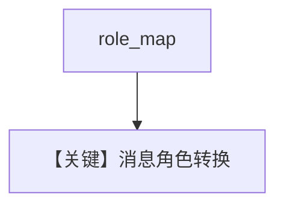

# custom_role_map.py — 实现原理分析

> 源文件：`cookbook/90_models/openai/chat/custom_role_map.py`

## 概述

**`OpenAIChat` 指向 Mistral 兼容端点**（`base_url` + `MISTRAL_API_KEY`）并传入 **`role_map`**（含 `"model": "assistant"`），适配非标准角色名。

**核心配置一览：**

| 配置项 | 值 | 说明 |
|--------|------|------|
| `model` | `OpenAIChat(id="mistral-medium-2505", base_url=..., api_key=..., role_map=mistral_role_map)` | 自定义映射 |
| `markdown` | `True` | 默认 |

用户消息：`"Hey, how are you doing?"`

## Mermaid 流程图

## 关键源码文件索引

| 文件 | 作用 |
|------|------|
| `agno/models/openai/chat.py` | `role_map` |
