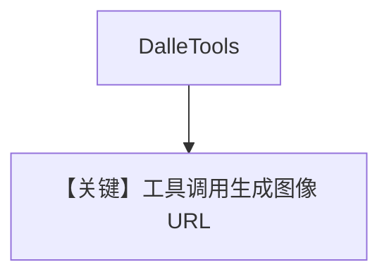

# generate_images.py — 实现原理分析

> 源文件：`cookbook/90_models/openai/chat/generate_images.py`

## 概述

**DalleTools + description + instructions**：gpt-4o 调用 `create_image` 生图，并从 `get_last_run_output().images` 取 URL。

**核心配置一览：**

| 配置项 | 值 | 说明 |
|--------|------|------|
| `model` | `OpenAIChat(id="gpt-4o")` | Chat |
| `tools` | `[DalleTools()]` | 文生图 |
| `description` | `"You are an AI agent that can generate images using DALL-E."` | 字面量 |
| `instructions` | `"When the user asks you to create an image, use the \`create_image\` tool..."` | 字面量 |
| `markdown` | `True` | 默认 |

## System Prompt 组装

两段用户字面量均进入默认 system 拼装（description → instructions）。

用户消息：`"Generate an image of a white siamese cat"`

## Mermaid 流程图

## 关键源码文件索引

| 文件 | 作用 |
|------|------|
| `agno/tools/dalle.py` | `DalleTools` |
