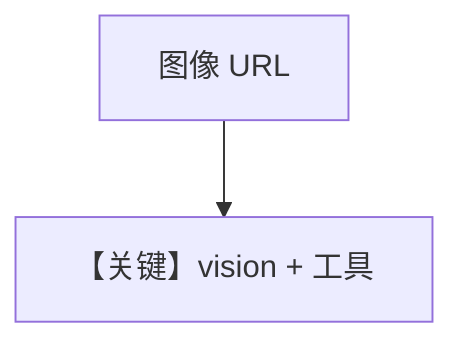

# image_agent.py — 实现原理分析

> 源文件：`cookbook/90_models/openai/chat/image_agent.py`

## 概述

**gpt-4o + WebSearchTools + Image(url)**：看图并联网查新闻，流式。

**核心配置一览：**

| 配置项 | 值 | 说明 |
|--------|------|------|
| `model` | `OpenAIChat(id="gpt-4o")` | 视觉 |
| `tools` | `[WebSearchTools()]` | 搜索 |
| `markdown` | `True` | 默认 |

用户消息：`"Tell me about this image and give me the latest news about it."` + 金门大桥图

## Mermaid 流程图

## 关键源码文件索引

| 文件 | 作用 |
|------|------|
| `agno/models/openai/chat.py` | 多模态 invoke |
