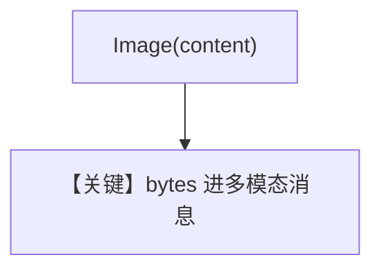

# image_agent_bytes.py — 实现原理分析

> 源文件：`cookbook/90_models/openai/chat/image_agent_bytes.py`

## 概述

**`download_image` 落盘再读 bytes + `Image(content=)`**，与 `image_agent.py` 对照为字节输入形态。

**核心配置一览：**

| 配置项 | 值 | 说明 |
|--------|------|------|
| `model` | `OpenAIChat(id="gpt-4o")` | 视觉 |
| `tools` | `[WebSearchTools()]` | 搜索 |
| `markdown` | `True` | 默认 |

## Mermaid 流程图

## 关键源码文件索引

| 文件 | 作用 |
|------|------|
| `agno/utils/media.py` | `download_image` |
