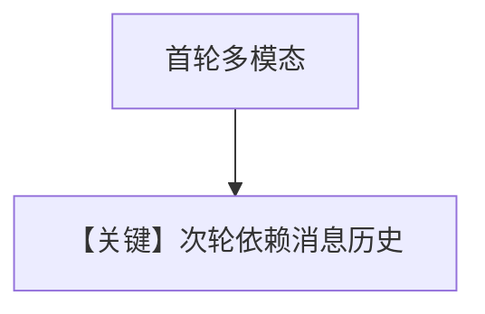

# image_agent_with_memory.py — 实现原理分析

> 源文件：`cookbook/90_models/openai/chat/image_agent_with_memory.py`

## 概述

**图像 + 工具 + `add_history_to_context` + `num_history_runs=3`**：第二轮仅文本追问图片来源。

**核心配置一览：**

| 配置项 | 值 | 说明 |
|--------|------|------|
| `model` | `OpenAIChat(id="gpt-4o")` | 视觉 |
| `tools` | `[WebSearchTools()]` | 搜索 |
| `add_history_to_context` | `True` | 历史 |
| `num_history_runs` | `3` | 历史深度 |
| `markdown` | `True` | 默认 |

用户消息1：看图+新闻；用户消息2：`"Tell me where I can get more images?"`

## Mermaid 流程图

## 关键源码文件索引

| 文件 | 作用 |
|------|------|
| `agno/agent/_messages.py` | 历史注入 |
