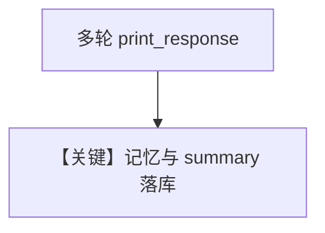

# memory.py — 实现原理分析

> 源文件：`cookbook/90_models/openai/chat/memory.py`

## 概述

**`update_memory_on_run` + `enable_session_summaries` + Postgres + user_id/session_id**，与 `access_memories_*` 不同：本示例用 **`update_memory_on_run`** 并 `pprint` 记忆与 summary。

**核心配置一览：**

| 配置项 | 值 | 说明 |
|--------|------|------|
| `model` | `OpenAIChat(id="gpt-4o")` | Chat |
| `db` | `PostgresDb` | 持久化 |
| `user_id` | `"test_user"` | 用户 |
| `session_id` | `"test_session"` | 会话 |
| `update_memory_on_run` | `True` | 记忆更新 |
| `enable_session_summaries` | `True` | 摘要 |

## Mermaid 流程图

## 关键源码文件索引

| 文件 | 作用 |
|------|------|
| `agno/agent/_messages.py` | `# 3.3.9` |
