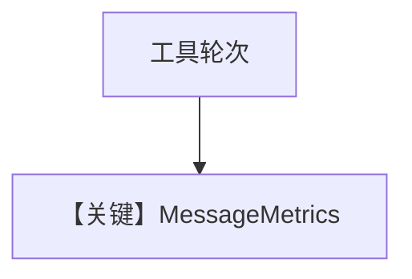

# metrics.py — 实现原理分析

> 源文件：`cookbook/90_models/openai/chat/metrics.py`

## 概述

**YFinanceTools + `pprint_run_response` + 逐 assistant `message.metrics`**。

**核心配置一览：**

| 配置项 | 值 | 说明 |
|--------|------|------|
| `model` | `OpenAIChat(id="gpt-4o")` | Chat |
| `tools` | `[YFinanceTools()]` | 金融 |
| `markdown` | `True` | 默认 |

用户消息：`"What is the stock price of NVDA"`

## Mermaid 流程图

## 关键源码文件索引

| 文件 | 作用 |
|------|------|
| `agno/models/metrics.py` | `MessageMetrics` |
