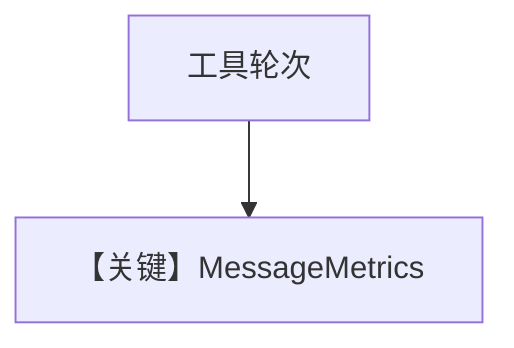

# metrics.py — 实现原理分析

<!-- cookbook-py-source:start -->
## 完整源码

```python
"""
Openai Metrics
==============

Cookbook example for `openai/chat/metrics.py`.
"""

from agno.agent import Agent, RunOutput
from agno.models.openai import OpenAIChat
from agno.tools.yfinance import YFinanceTools
from agno.utils.pprint import pprint_run_response
from rich.pretty import pprint

# ---------------------------------------------------------------------------
# Create Agent
# ---------------------------------------------------------------------------

agent = Agent(
    model=OpenAIChat(id="gpt-4o"),
    tools=[YFinanceTools()],
    markdown=True,
)

run_output: RunOutput = agent.run("What is the stock price of NVDA")
pprint_run_response(run_output, markdown=True)

# Print metrics per message
if run_output.messages:
    for message in run_output.messages:
        if message.role == "assistant":
            if message.content:
                print(f"Message: {message.content}")
            elif message.tool_calls:
                print(f"Tool calls: {message.tool_calls}")
            print("---" * 5, "Metrics", "---" * 5)
            pprint(message.metrics)
            print("---" * 20)

# Print the metrics
print("---" * 5, "Collected Metrics", "---" * 5)
pprint(run_output.metrics)  # type: ignore

# ---------------------------------------------------------------------------
# Run Agent
# ---------------------------------------------------------------------------

if __name__ == "__main__":
    pass
```

<!-- cookbook-py-source:end -->

> 源文件：`cookbook/90_models/openai/chat/metrics.py`

## 概述

**YFinanceTools + `pprint_run_response` + 逐 assistant `message.metrics`**。

**核心配置一览：**

| 配置项 | 值 | 说明 |
|--------|------|------|
| `model` | `OpenAIChat(id="gpt-4o")` | Chat |
| `tools` | `[YFinanceTools()]` | 金融 |
| `markdown` | `True` | 默认 |

用户消息：`"What is the stock price of NVDA"`

## Mermaid 流程图



## 关键源码文件索引

| 文件 | 作用 |
|------|------|
| `agno/models/metrics.py` | `MessageMetrics` |
