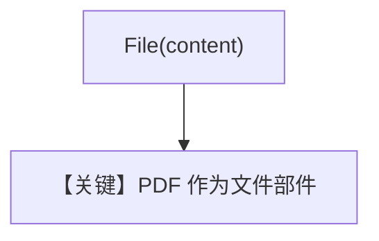

# pdf_input_bytes.py — 实现原理分析

<!-- cookbook-py-source:start -->
## 完整源码

```python
"""
Openai Pdf Input Bytes
=========================
"""

from pathlib import Path

from agno.agent import Agent
from agno.media import File
from agno.models.openai.chat import OpenAIChat
from agno.utils.media import download_file

# ---------------------------------------------------------------------------
# Create Agent
# ---------------------------------------------------------------------------

pdf_path = Path(__file__).parent.joinpath("ThaiRecipes.pdf")

# Download the file using the download_file function
download_file(
    "https://agno-public.s3.amazonaws.com/recipes/ThaiRecipes.pdf", str(pdf_path)
)

agent = Agent(
    model=OpenAIChat(id="gpt-5-mini"),
    markdown=True,
)

agent.print_response(
    "Summarize the contents of the attached file.",
    files=[
        File(
            content=pdf_path.read_bytes(),
        ),
    ],
)
```

<!-- cookbook-py-source:end -->

> 源文件：`cookbook/90_models/openai/chat/pdf_input_bytes.py`

## 概述

**`from agno.models.openai.chat import OpenAIChat`**（与包级导入等价）+ **`File(content=pdf_bytes)`**，gpt-5-mini 总结附件。

**核心配置一览：**

| 配置项 | 值 | 说明 |
|--------|------|------|
| `model` | `OpenAIChat(id="gpt-5-mini")` | Chat |
| `markdown` | `True` | 默认 |

用户消息：`"Summarize the contents of the attached file."` + PDF 字节

## Mermaid 流程图



## 关键源码文件索引

| 文件 | 作用 |
|------|------|
| `agno/media` | `File` |
