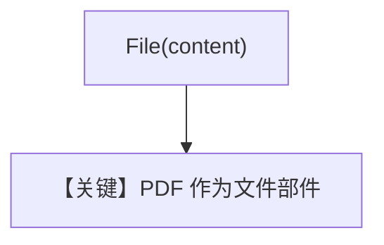

# pdf_input_bytes.py — 实现原理分析

> 源文件：`cookbook/90_models/openai/chat/pdf_input_bytes.py`

## 概述

**`from agno.models.openai.chat import OpenAIChat`**（与包级导入等价）+ **`File(content=pdf_bytes)`**，gpt-5-mini 总结附件。

**核心配置一览：**

| 配置项 | 值 | 说明 |
|--------|------|------|
| `model` | `OpenAIChat(id="gpt-5-mini")` | Chat |
| `markdown` | `True` | 默认 |

用户消息：`"Summarize the contents of the attached file."` + PDF 字节

## Mermaid 流程图

## 关键源码文件索引

| 文件 | 作用 |
|------|------|
| `agno/media` | `File` |
