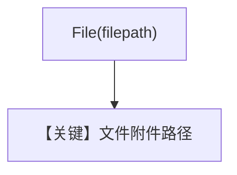

# pdf_input_file_upload.py — 实现原理分析

<!-- cookbook-py-source:start -->
## 完整源码

```python
"""
In this example, we upload a PDF file to Google GenAI directly and then use it as an input to an agent.
"""

from pathlib import Path

from agno.agent import Agent
from agno.media import File
from agno.models.openai import OpenAIChat

# ---------------------------------------------------------------------------
# Create Agent
# ---------------------------------------------------------------------------

pdf_path = Path(__file__).parent.joinpath("ThaiRecipes.pdf")

# Pass the local PDF file path directly; the client will inline small files or upload large files automatically
agent = Agent(
    model=OpenAIChat(id="gpt-4o"),
    markdown=True,
    add_history_to_context=True,
)

agent.print_response(
    "Suggest me a recipe from the attached file.",
    files=[File(filepath=str(pdf_path))],
)

# ---------------------------------------------------------------------------
# Run Agent
# ---------------------------------------------------------------------------

if __name__ == "__main__":
    pass
```

<!-- cookbook-py-source:end -->

> 源文件：`cookbook/90_models/openai/chat/pdf_input_file_upload.py`

## 概述

**`File(filepath=...)`** 本地 PDF；注释提及 GenAI 上传行为，**代码实际为 `OpenAIChat`**，按 OpenAI 文件内联/上传策略处理。

**核心配置一览：**

| 配置项 | 值 | 说明 |
|--------|------|------|
| `model` | `OpenAIChat(id="gpt-4o")` | Chat |
| `markdown` | `True` | 默认 |
| `add_history_to_context` | `True` | 历史 |

用户消息：`"Suggest me a recipe from the attached file."`

## Mermaid 流程图



## 关键源码文件索引

| 文件 | 作用 |
|------|------|
| `agno/models/openai/chat.py` | 文件编码 |
