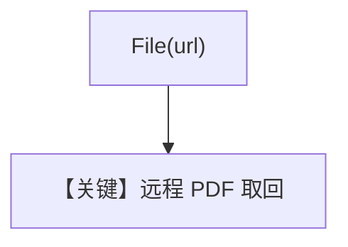

# pdf_input_url.py — 实现原理分析

> 源文件：`cookbook/90_models/openai/chat/pdf_input_url.py`

## 概述

**`File(url=...)`** 直接传 PDF URL，无需本地先下载。

**核心配置一览：**

| 配置项 | 值 | 说明 |
|--------|------|------|
| `model` | `OpenAIChat(id="gpt-4o")` | Chat |
| `markdown` | `True` | 默认 |
| `add_history_to_context` | `True` | 历史 |

用户消息：`"Suggest me a recipe from the attached file."`

## Mermaid 流程图

## 关键源码文件索引

| 文件 | 作用 |
|------|------|
| `agno/media` | `File` |
