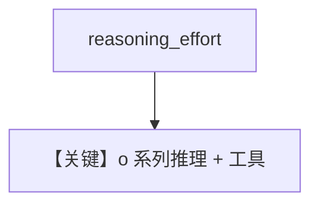

# reasoning_o3_mini.py — 实现原理分析

<!-- cookbook-py-source:start -->
## 完整源码

```python
"""
Openai Reasoning O3 Mini
========================

Cookbook example for `openai/chat/reasoning_o3_mini.py`.
"""

from agno.agent import Agent
from agno.models.openai import OpenAIChat
from agno.tools.yfinance import YFinanceTools

# ---------------------------------------------------------------------------
# Create Agent
# ---------------------------------------------------------------------------

agent = Agent(
    model=OpenAIChat(id="o3-mini", reasoning_effort="high"),
    tools=[YFinanceTools()],
    markdown=True,
)

# Print the response in the terminal
agent.print_response("Write a report on the NVDA, is it a good buy?", stream=True)

# ---------------------------------------------------------------------------
# Run Agent
# ---------------------------------------------------------------------------

if __name__ == "__main__":
    pass
```

<!-- cookbook-py-source:end -->

> 源文件：`cookbook/90_models/openai/chat/reasoning_o3_mini.py`

## 概述

**`o3-mini` + `reasoning_effort="high"` + YFinanceTools**，流式投资报告。

**核心配置一览：**

| 配置项 | 值 | 说明 |
|--------|------|------|
| `model` | `OpenAIChat(id="o3-mini", reasoning_effort="high")` | 推理模型参数 |
| `tools` | `[YFinanceTools()]` | 金融 |
| `markdown` | `True` | 默认 |

用户消息：`"Write a report on the NVDA, is it a good buy?"`

## Mermaid 流程图



## 关键源码文件索引

| 文件 | 作用 |
|------|------|
| `agno/models/openai/chat.py` | `reasoning_effort` |
