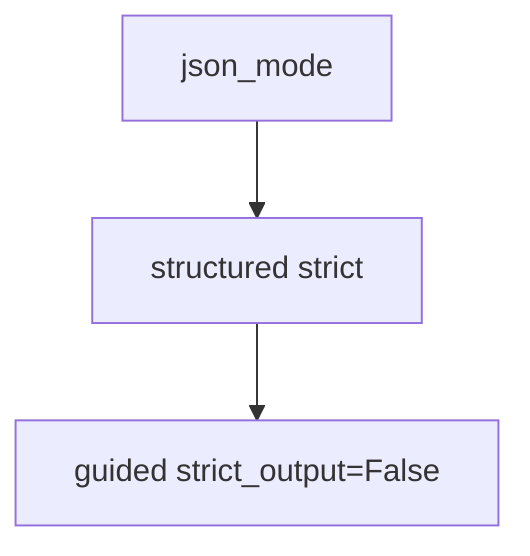

# structured_output.py — 实现原理分析

<!-- cookbook-py-source:start -->
## 完整源码

```python
"""
Openai Structured Output
========================

Cookbook example for `openai/chat/structured_output.py`.
"""

import asyncio
from typing import Dict, List

from agno.agent import Agent, RunOutput  # noqa
from agno.models.openai import OpenAIChat
from pydantic import BaseModel, Field
from rich.pretty import pprint  # noqa

# ---------------------------------------------------------------------------
# Create Agent
# ---------------------------------------------------------------------------


class MovieScript(BaseModel):
    setting: str = Field(
        ..., description="Provide a nice setting for a blockbuster movie."
    )
    ending: str = Field(
        ...,
        description="Ending of the movie. If not available, provide a happy ending.",
    )
    genre: str = Field(
        ...,
        description="Genre of the movie. If not available, select action, thriller or romantic comedy.",
    )
    name: str = Field(..., description="Give a name to this movie")
    characters: List[str] = Field(..., description="Name of characters for this movie.")
    storyline: str = Field(
        ..., description="3 sentence storyline for the movie. Make it exciting!"
    )
    rating: Dict[str, int] = Field(
        ...,
        description="Your own rating of the movie. 1-10. Return a dictionary with the keys 'story' and 'acting'.",
    )


# Agent that uses JSON mode
json_mode_agent = Agent(
    model=OpenAIChat(id="gpt-4o"),
    description="You write movie scripts.",
    output_schema=MovieScript,
    use_json_mode=True,
)

# Agent that uses structured outputs with strict_output=True (default)
structured_output_agent = Agent(
    model=OpenAIChat(id="gpt-4o"),
    description="You write movie scripts.",
    output_schema=MovieScript,
)

# Agent with strict_output=False (guided mode)
guided_output_agent = Agent(
    model=OpenAIChat(id="gpt-4o", strict_output=False),
    description="You write movie scripts.",
    output_schema=MovieScript,
)

# Get the response in a variable
# json_mode_response: RunOutput = json_mode_agent.run("New York")
# pprint(json_mode_response.content)
# structured_output_response: RunOutput = structured_output_agent.run("New York")
# pprint(structured_output_response.content)

# ---------------------------------------------------------------------------
# Run Agent
# ---------------------------------------------------------------------------
if __name__ == "__main__":
    # --- Sync ---
    json_mode_agent.print_response("New York")

    structured_output_agent.print_response("New York")

    guided_output_agent.print_response("New York")

    # --- Sync + Streaming ---
    structured_output_agent.print_response("New York", stream=True)

    # --- Async + Streaming ---
    async def main():
        await structured_output_agent.aprint_response("New York", stream=True)

    asyncio.run(main())
```

<!-- cookbook-py-source:end -->

> 源文件：`cookbook/90_models/openai/chat/structured_output.py`

## 概述

**同一 `MovieScript` 三种 Agent 对照**：`use_json_mode=True` 的 `json_mode_agent`、默认 `structured_outputs` 的 `structured_output_agent`、`strict_output=False` 的 `guided_output_agent`。

**核心配置一览：**

| 配置项 | 值 | 说明 |
|--------|------|------|
| `model` | `OpenAIChat(id="gpt-4o")` / `strict_output=False` 仅第三个 | schema 严格度 |
| `description` | `"You write movie scripts."` | 三实例相同 |
| `output_schema` | `MovieScript`（含 `rating` 字典字段） | Pydantic |
| `use_json_mode` | 仅第一个为 `True` | JSON 模式分支 |

## System Prompt 组装

### description 原样（三实例相同）

```text
You write movie scripts.
```

`# 3.3.15` 对三者是否追加 `get_json_output_prompt` 因 `use_json_mode` / `strict_output` / 模型能力而异，需对照 `_messages.py` L427-434 与运行时打印。

用户消息：`"New York"`（三实例均使用）

## Mermaid 流程图



## 关键源码文件索引

| 文件 | 作用 |
|------|------|
| `agno/models/openai/chat.py` | `strict_output` / `get_request_params` |
| `agno/agent/_messages.py` | `# 3.3.15` |
