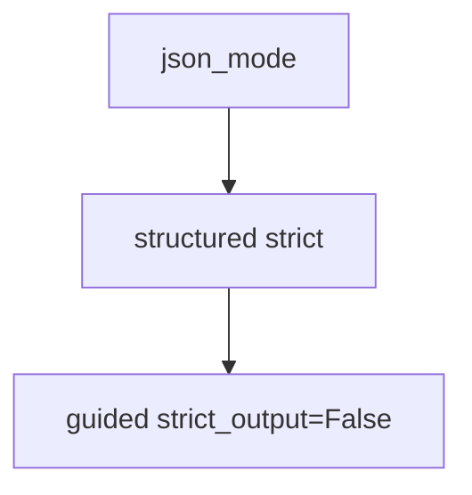

# structured_output.py — 实现原理分析

> 源文件：`cookbook/90_models/openai/chat/structured_output.py`

## 概述

**同一 `MovieScript` 三种 Agent 对照**：`use_json_mode=True` 的 `json_mode_agent`、默认 `structured_outputs` 的 `structured_output_agent`、`strict_output=False` 的 `guided_output_agent`。

**核心配置一览：**

| 配置项 | 值 | 说明 |
|--------|------|------|
| `model` | `OpenAIChat(id="gpt-4o")` / `strict_output=False` 仅第三个 | schema 严格度 |
| `description` | `"You write movie scripts."` | 三实例相同 |
| `output_schema` | `MovieScript`（含 `rating` 字典字段） | Pydantic |
| `use_json_mode` | 仅第一个为 `True` | JSON 模式分支 |

## System Prompt 组装

### description 原样（三实例相同）

```text
You write movie scripts.
```

`# 3.3.15` 对三者是否追加 `get_json_output_prompt` 因 `use_json_mode` / `strict_output` / 模型能力而异，需对照 `_messages.py` L427-434 与运行时打印。

用户消息：`"New York"`（三实例均使用）

## Mermaid 流程图



## 关键源码文件索引

| 文件 | 作用 |
|------|------|
| `agno/models/openai/chat.py` | `strict_output` / `get_request_params` |
| `agno/agent/_messages.py` | `# 3.3.15` |
