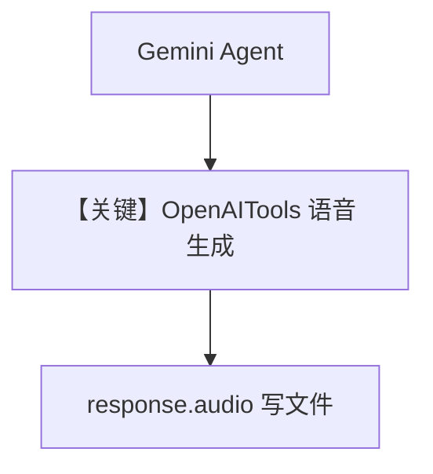

# text_to_speech_agent.py — 实现原理分析

> 源文件：`cookbook/90_models/openai/chat/text_to_speech_agent.py`

## 概述

本文件位于 `openai/chat/` 目录，但 **模型为 `Gemini(id="gemini-2.5-pro")` + `OpenAITools(enable_speech_generation=True)`**，演示通过 OpenAI 工具包做 **TTS**，而非 `OpenAIChat` 直连。

**核心配置一览：**

| 配置项 | 值 | 说明 |
|--------|------|------|
| `model` | `Gemini(id="gemini-2.5-pro")` | 非 OpenAIChat |
| `tools` | `[OpenAITools(enable_speech_generation=True)]` | 语音生成 |
| `markdown` | `True` | 默认 |

### 与「单一 OpenAI Agent」示例的差异

不存在以 `OpenAIChat` 为主的单一链路；**system 拼装仍走 `Agent` + `Gemini` 适配器**，须读 `agno/models/google` 的 `get_system_message` 等价逻辑（若与 OpenAI 分叉则在对应模型消息层）。

用户消息（`agent.run` 输入）：请朗读固定英文句子（见源码字符串）。

## Mermaid 流程图

## 关键源码文件索引

| 文件 | 作用 |
|------|------|
| `agno/tools/openai.py` | `OpenAITools` |
| `agno/models/google/` | `Gemini` |
