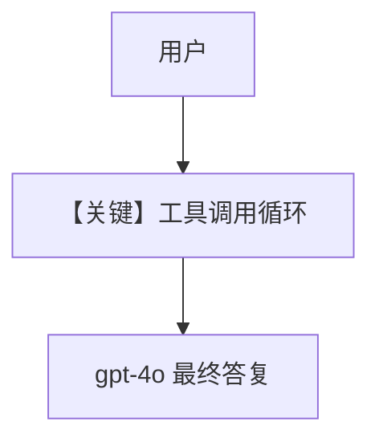

# tool_use.py — 实现原理分析

<!-- cookbook-py-source:start -->
## 完整源码

```python
"""Run `uv pip install ddgs` to install dependencies."""

import asyncio

from agno.agent import Agent
from agno.models.openai import OpenAIChat
from agno.tools.websearch import WebSearchTools

# ---------------------------------------------------------------------------
# Create Agent
# ---------------------------------------------------------------------------

agent = Agent(
    model=OpenAIChat(id="gpt-4o"),
    tools=[WebSearchTools()],
    markdown=True,
)

# ---------------------------------------------------------------------------
# Run Agent
# ---------------------------------------------------------------------------
if __name__ == "__main__":
    # --- Sync ---
    agent.print_response("Whats happening in France?")

    # --- Sync + Streaming ---
    agent.print_response("Whats happening in France?", stream=True)

    # --- Async + Streaming ---
    asyncio.run(agent.aprint_response("Whats happening in France?", stream=True))
```

<!-- cookbook-py-source:end -->

> 源文件：`cookbook/90_models/openai/chat/tool_use.py`

## 概述

**`OpenAIChat(gpt-4o)` + WebSearchTools**，同步、流式与异步流式查询法国新闻。

**核心配置一览：**

| 配置项 | 值 | 说明 |
|--------|------|------|
| `model` | `OpenAIChat(id="gpt-4o")` | Chat Completions |
| `tools` | `[WebSearchTools()]` | 搜索 |
| `markdown` | `True` | 默认 |

用户消息：`"Whats happening in France?"`

## System Prompt 组装

无用户 description；含工具说明与 Markdown 默认句。

## 完整 API 请求

```python
# 典型形态
client.chat.completions.create(
    model="gpt-4o",
    messages=[
        {"role": "system", "content": "<拼装 system>"},
        {"role": "user", "content": "Whats happening in France?"},
    ],
    tools=[...],
    tool_choice="auto",
)
```

## Mermaid 流程图



## 关键源码文件索引

| 文件 | 作用 |
|------|------|
| `agno/models/openai/chat.py` | `invoke` |
| `agno/agent/_messages.py` | `get_system_message` L262+ 工具 |
