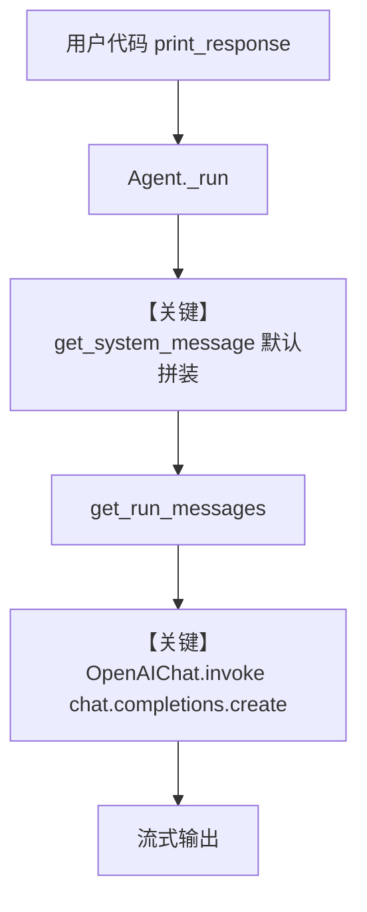

# verbosity_control.py — 实现原理分析

> 源文件：`cookbook/90_models/openai/chat/verbosity_control.py`

## 概述

本示例展示 Agno 的 **`OpenAIChat` + `verbosity`** 机制：在 Chat Completions 路径上向 OpenAI 传递输出详略控制，配合工具与指令生成结构化报告。

**核心配置一览：**

| 配置项 | 值 | 说明 |
|--------|------|------|
| `model` | `OpenAIChat(id="gpt-5", verbosity="high")` | Chat Completions API；verbosity 控制输出长度/细节 |
| `tools` | `[YFinanceTools()]` | 行情等工具 |
| `instructions` | `"Use tables to display data."` | 用户指令进入默认 system |
| `markdown` | `True` | 追加「使用 Markdown」附加段 |
| `name` | 未设置 | 未设置 |
| `description` | 未设置 | 未设置 |
| `db` / `knowledge` | 未设置 | 未设置 |

## 架构分层

```
用户代码层                agno.agent 层
┌──────────────────┐    ┌──────────────────────────────────┐
│ verbosity_       │    │ Agent.print_response / _run      │
│ control.py       │───>│ get_system_message() L106        │
│ OpenAIChat       │    │ get_run_messages() L1156         │
│ verbosity=high   │    │ model.invoke() chat.completions  │
└──────────────────┘    └──────────────────────────────────┘
                                │
                                ▼
                        ┌──────────────┐
                        │ OpenAIChat   │
                        │ gpt-5        │
                        └──────────────┘
```

## 核心组件解析

### OpenAIChat 与 verbosity

`OpenAIChat` 将 `verbosity` 传入请求参数（与 `get_request_params` 合并），最终由 `chat.completions.create` 发往 OpenAI（见 `agno/models/openai/chat.py` `invoke()` 约 L385–418）。

### YFinanceTools

工具经 Agent 注册后进入 `get_tools()`，模型可在多轮中调用；system 中可能包含工具使用说明（`_tool_instructions` 等，取决于框架组装）。

### 运行机制与因果链

1. **数据路径**：`print_response` → `run` → `get_system_message` 组装默认 system（instructions + markdown 附加段等）→ `get_run_messages` 合并用户消息 → `OpenAIChat.invoke` → Chat Completions 返回 → 流式打印。
2. **状态**：无 `db`/`knowledge`；单次 run 无持久会话历史（除非另行配置）。
3. **分支**：`verbosity` 为 high 时请求体携带相应参数；若改为 `low` 则输出倾向更短。
4. **定位**：同属 `openai/chat`，本文件强调 **verbosity**，与 `with_retries.py` 强调重试形成对照。

## System Prompt 组装

| 序号 | 组成部分 | 本文件中的值/来源 | 是否生效 |
|------|---------|-----------------|---------|
| 1 | `description` | 未设置 | 否 |
| 2 | `role` | 未设置 | 否 |
| 3 | `instructions` | `"Use tables to display data."` | 是 |
| 4.1 | `markdown` | `True` | 是（`additional_information` 中 Markdown 提示，`_messages.py` #3.2.1） |
| 5 | 默认路径 | `system_message is None`，走 `build_context` 默认拼装 | 是 |

### 拼装顺序与源码锚点

1. `# 3.1` / `# 3.1.1`：用户 `instructions` 与 `model.get_instructions_for_model`。
2. `# 3.2.1`：`markdown=True` 且无语义 `output_schema` 时追加 Markdown 格式说明。
3. `# 3.3.1`–`# 3.3.4`：description、role、instructions 块、`additional_information` 块。

### 还原后的完整 System 文本

（拼装顺序：`#3.3.3` 指令段在前，`#3.3.4` 附加信息在后。）

```text
Use tables to display data.


<additional_information>
- Use markdown to format your answers.
</additional_information>

```

（若 `use_instruction_tags` 等为默认，实际换行/标签以运行时代码为准；可于 `get_system_message` 返回前打印 `Message.content` 校验。）

### 段落释义（模型视角）

- 指令要求用表格展示数据，约束输出版式。
- Markdown 附加段要求使用 Markdown，便于终端渲染。

### 与 User 消息边界

用户消息为 `"Write a report comparing NVDA to TSLA"`；工具调用与行情数据在对话与 API 的 `messages`/`tools` 中传递，不由 system 重复用户句。

## 完整 API 请求

```python
# OpenAI Chat Completions（与 OpenAIChat.invoke 一致）
client.chat.completions.create(
    model="gpt-5",
    messages=[
        # role=system: 由上节还原的 system 文本
        # role=user: "Write a report comparing NVDA to TSLA"
    ],
    tools=[...],  # YFinance 工具 schema
    stream=True,
    # + verbosity 等由 Model.get_request_params 合并
)
```

## Mermaid 流程图



- **【关键】get_system_message**：合并 instructions 与 Markdown 附加段。
- **【关键】OpenAIChat.invoke**：Chat Completions，含 verbosity 与工具。

## 关键源码文件索引

| 文件 | 关键函数/类 | 作用 |
|------|------------|------|
| `agno/agent/_messages.py` | `get_system_message()` L106 | 默认 system 拼装 |
| `agno/models/openai/chat.py` | `OpenAIChat.invoke()` L385 | Chat Completions 调用 |
| `agno/agent/agent.py` | `run` / `print_response` L1263 起 | Agent 执行入口 |
