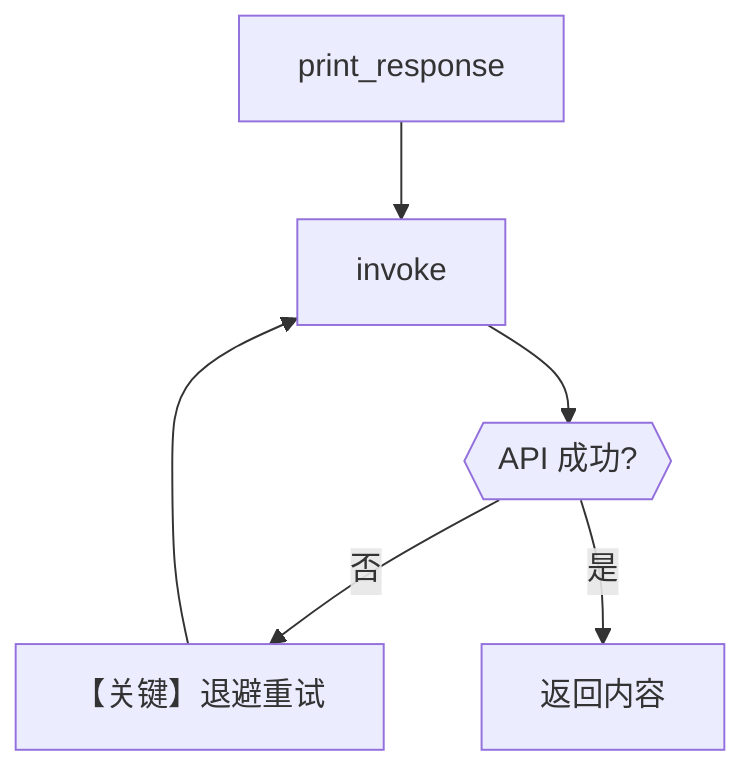

# with_retries.py — 实现原理分析

> 源文件：`cookbook/90_models/openai/chat/with_retries.py`

## 概述

本示例展示 Agno 的 **`OpenAIChat` 模型层重试** 机制：通过错误的 `id` 触发失败，依赖 `retries`、`delay_between_retries`、`exponential_backoff` 在适配器侧重试（仍可能最终失败，用于演示配置）。

**核心配置一览：**

| 配置项 | 值 | 说明 |
|--------|------|------|
| `model` | `OpenAIChat(id="gpt-wrong-id", retries=3, delay_between_retries=1, exponential_backoff=True)` | Chat Completions；故意错误 id |
| `instructions` / `tools` / `markdown` | 未设置 | 未设置 |

## 架构分层

```
用户代码层                agno.agent 层
┌──────────────────┐    ┌──────────────────────────────────┐
│ with_retries.py  │───>│ Agent.print_response               │
│ 错误 model id    │    │ Model 层重试 → invoke 循环/退避     │
└──────────────────┘    └──────────────────────────────────┘
                                │
                                ▼
                        ┌──────────────┐
                        │ OpenAI API   │
                        │ 预期报错      │
                        └──────────────┘
```

## 核心组件解析

### 重试参数

重试在模型调用链中处理（与 `OpenAIChat`/`Model` 基类中的错误处理与重试逻辑相关）；`exponential_backoff=True` 时重试间隔递增。

### 运行机制与因果链

1. **路径**：`print_response` → `run` → `invoke`；每次失败可能触发重试直至次数用尽。
2. **状态**：无持久化；重试不写入 session 除非配置了 `db`。
3. **分支**：合法 `id` 时通常一次成功；错误 `id` 时走错误分支与重试。
4. **定位**：与 Portkey/Requesty 等同目录 `retry.py` 一样，演示 **模型 id + 重试参数**，无业务工具。

## System Prompt 组装

| 序号 | 组成部分 | 本文件 | 是否生效 |
|------|---------|--------|---------|
| `instructions` | 未设置 | 否 |
| `markdown` | 未设置（默认 False） | 否 |
| 默认拼装 | 仅框架默认（无用户 instructions） | 视 Agent 默认而定 |

### 还原后的完整 System 文本

本示例未设置 `instructions`、`markdown`、`description`。若 `build_context` 为默认 True 且无其它段，system 可能极短或仅含模型侧附加说明；**以运行时 `get_system_message()` 返回值为准**，建议在返回前打印 `Message.content` 验证。

### 段落释义

无显式业务指令时，模型主要依赖默认行为回答 `"What is the capital of France?"`。

## 完整 API 请求

```python
# 每次重试等价于一次 chat.completions.create（model=gpt-wrong-id）
client.chat.completions.create(
    model="gpt-wrong-id",
    messages=[...],  # system + user
)
# 预期 4xx/模型错误 → 重试逻辑
```

## Mermaid 流程图



- **【关键】退避重试**：`delay_between_retries` 与 `exponential_backoff` 控制重试节奏。

## 关键源码文件索引

| 文件 | 关键函数/类 | 作用 |
|------|------------|------|
| `agno/models/openai/chat.py` | `OpenAIChat.invoke()` L385 | Chat 请求与错误 |
| `agno/models/base.py` | Model 重试相关逻辑 | 重试与退避 |
| `agno/agent/_messages.py` | `get_system_message()` L106 | System 文本 |
