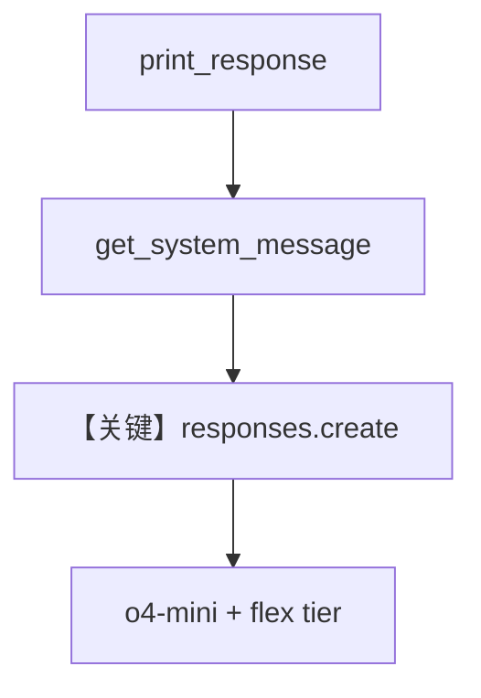

# agent_flex_tier.py — 实现原理分析

<!-- cookbook-py-source:start -->
## 完整源码

```python
"""
Openai Agent Flex Tier
======================

Cookbook example for `openai/responses/agent_flex_tier.py`.
"""

from agno.agent import Agent
from agno.models.openai import OpenAIResponses

# ---------------------------------------------------------------------------
# Create Agent
# ---------------------------------------------------------------------------

agent = Agent(
    model=OpenAIResponses(id="o4-mini", service_tier="flex"),
    markdown=True,
)

agent.print_response("Share a 2 sentence horror story")

# ---------------------------------------------------------------------------
# Run Agent
# ---------------------------------------------------------------------------

if __name__ == "__main__":
    pass
```

<!-- cookbook-py-source:end -->

> 源文件：`cookbook/90_models/openai/responses/agent_flex_tier.py`

## 概述

本示例展示 Agno 的 **`OpenAIResponses` + `service_tier="flex"`** 机制：使用 Responses API 与 OpenAI 弹性计费档位，降低延迟敏感场景成本。

**核心配置一览：**

| 配置项 | 值 | 说明 |
|--------|------|------|
| `model` | `OpenAIResponses(id="o4-mini", service_tier="flex")` | Responses API |
| `markdown` | `True` | Markdown 附加段 |

## 架构分层

```
用户代码层                agno.agent 层
┌──────────────────┐    ┌──────────────────────────────────┐
│ agent_flex_tier  │───>│ get_system_message → get_run_messages │
│ service_tier=flex│    │ OpenAIResponses.invoke             │
└──────────────────┘    └──────────────────────────────────┘
                                │
                                ▼
                        ┌──────────────────┐
                        │ responses.create │
                        │ o4-mini + flex   │
                        └──────────────────┘
```

## 核心组件解析

### OpenAIResponses 与 service_tier

`service_tier` 进入 `get_request_params`，随 `responses.create` 提交（见 `agno/models/openai/responses.py` `invoke()` 约 L671–695）。

### 运行机制与因果链

1. **路径**：`print_response` → `invoke` → `client.responses.create(model=..., **request_params)`，`input` 由 `_format_messages` 生成。
2. **状态**：无 `db`；单次会话无历史。
3. **分支**：`service_tier="flex"` 与默认 `standard` 相比可走不同排队/价格策略（以 OpenAI 文档为准）。
4. **定位**：`90_models/openai/responses` 中展示 **计费档位** 的最小示例。

## System Prompt 组装

| 组成部分 | 本文件 | 是否生效 |
|---------|--------|---------|
| `instructions` | 未设置 | 否 |
| `markdown` | `True` | 是 |

### 还原后的完整 System 文本

```text
<additional_information>
- Use markdown to format your answers.
</additional_information>

```

### 段落释义

- 约束模型使用 Markdown，便于终端/`markdown=True` 展示。

## 完整 API 请求

```python
# Responses API（agno/models/openai/responses.py invoke ~L691）
client.responses.create(
    model="o4-mini",
    input=[...],  # _format_messages(messages, ...)
    service_tier="flex",
    # 其它参数来自 get_request_params
)
```

## Mermaid 流程图



- **【关键】responses.create**：本示例核心为 Responses 端点 + flex 档位。

## 关键源码文件索引

| 文件 | 关键函数/类 | 作用 |
|------|------------|------|
| `agno/models/openai/responses.py` | `invoke()` L671 | `responses.create` |
| `agno/agent/_messages.py` | `get_system_message()` L106 | System 拼装 |
