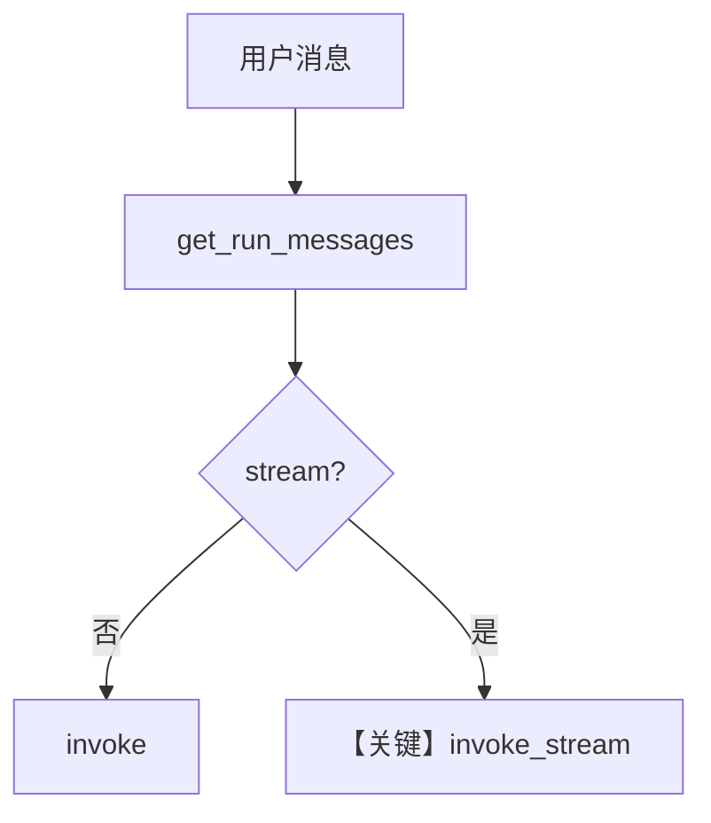

# basic.py — 实现原理分析

<!-- cookbook-py-source:start -->
## 完整源码

```python
"""
Openai Basic
============

Cookbook example for `openai/responses/basic.py`.
"""

from agno.agent import Agent, RunOutput  # noqa
from agno.models.openai import OpenAIResponses
import asyncio

# ---------------------------------------------------------------------------
# Create Agent
# ---------------------------------------------------------------------------

agent = Agent(model=OpenAIResponses(id="gpt-4o"), markdown=True)

# Get the response in a variable
# run: RunOutput = agent.run("Share a 2 sentence horror story")
# print(run.content)

# Print the response in the terminal

# ---------------------------------------------------------------------------
# Run Agent
# ---------------------------------------------------------------------------
if __name__ == "__main__":
    # --- Sync ---
    agent.print_response("Share a 2 sentence horror story")

    # --- Sync + Streaming ---
    agent.print_response("Share a 2 sentence horror story", stream=True)

    # --- Async ---
    asyncio.run(agent.aprint_response("Share a 2 sentence horror story"))

    # --- Async + Streaming ---
    asyncio.run(agent.aprint_response("Share a 2 sentence horror story", stream=True))
```

<!-- cookbook-py-source:end -->

> 源文件：`cookbook/90_models/openai/responses/basic.py`

## 概述

本示例展示 Agno 的 **`OpenAIResponses` 基础调用** 机制：同一 `Agent` 演示同步、同步流式、异步、异步流式四种 `print_response`/`aprint_response` 用法。

**核心配置一览：**

| 配置项 | 值 | 说明 |
|--------|------|------|
| `model` | `OpenAIResponses(id="gpt-4o")` | Responses API |
| `markdown` | `True` | Markdown 附加段 |

## 架构分层

```
用户代码层                agno.agent 层
┌──────────────────┐    ┌──────────────────────────────────┐
│ basic.py         │───>│ print_response / aprint_response  │
│ 多种 stream 模式  │    │ OpenAIResponses.invoke / stream   │
└──────────────────┘    └──────────────────────────────────┘
                                │
                                ▼
                        ┌──────────────────┐
                        │ responses.create │
                        └──────────────────┘
```

## 核心组件解析

### 同步与异步

`print_response` 走同步路径；`asyncio.run(agent.aprint_response(...))` 走异步路径。`stream=True` 时使用流式 API（`invoke_stream` 分支）。

### 运行机制与因果链

1. **路径**：用户字符串 → `get_run_messages` → `responses.create`；流式则消费 chunk。
2. **状态**：无 `db`；多次 `if __name__` 调用为独立 run（无跨调用历史，除非 session）。
3. **分支**：`stream=True` / `False` 决定是否流式。
4. **定位**：Responses 目录的 **Hello World**，与 `openai/chat` 下 Chat 示例对照。

## System Prompt 组装

未设置 `instructions`/`description`；`markdown=True` 生效。

### 还原后的完整 System 文本

```text
<additional_information>
- Use markdown to format your answers.
</additional_information>

```

## 完整 API 请求

```python
# 非流式
client.responses.create(model="gpt-4o", input=[...], ...)

# 流式
client.responses.create(model="gpt-4o", input=[...], stream=True, ...)
```

## Mermaid 流程图



- **【关键】invoke_stream**：`stream=True` 时走流式解析。

## 关键源码文件索引

| 文件 | 关键函数/类 | 作用 |
|------|------------|------|
| `agno/models/openai/responses.py` | `invoke` L671 / `invoke_stream` L811 | Responses 调用 |
| `agno/agent/_messages.py` | `get_run_messages()` L1156 | 消息列表 |
