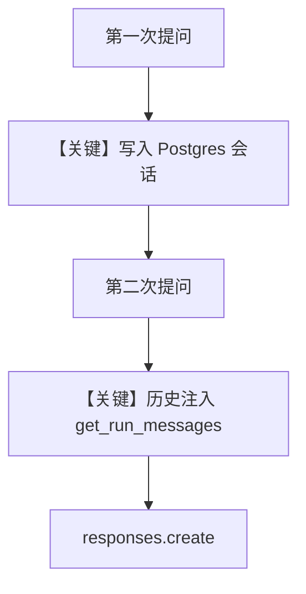

# db.py — 实现原理分析

<!-- cookbook-py-source:start -->
## 完整源码

```python
"""Run `uv pip install ddgs sqlalchemy openai` to install dependencies."""

from agno.agent import Agent
from agno.db.postgres import PostgresDb
from agno.models.openai import OpenAIResponses
from agno.tools.websearch import WebSearchTools

# ---------------------------------------------------------------------------
# Create Agent
# ---------------------------------------------------------------------------

# Setup the database
db_url = "postgresql+psycopg://ai:ai@localhost:5532/ai"
db = PostgresDb(db_url=db_url)

agent = Agent(
    model=OpenAIResponses(id="gpt-4o"),
    db=db,
    tools=[WebSearchTools()],
    add_history_to_context=True,
)
agent.print_response("How many people live in Canada?")
agent.print_response("What is their national anthem called?")

# ---------------------------------------------------------------------------
# Run Agent
# ---------------------------------------------------------------------------

if __name__ == "__main__":
    pass
```

<!-- cookbook-py-source:end -->

> 源文件：`cookbook/90_models/openai/responses/db.py`

## 概述

本示例展示 Agno 的 **`PostgresDb` + `add_history_to_context`** 机制：用 PostgreSQL 持久化会话，第二轮问题可依赖第一轮检索结果（加拿大人口 → 国歌）。

**核心配置一览：**

| 配置项 | 值 | 说明 |
|--------|------|------|
| `model` | `OpenAIResponses(id="gpt-4o")` | Responses API |
| `db` | `PostgresDb(db_url=...)` | 生产型存储（本示例连接本地 Postgres） |
| `tools` | `[WebSearchTools()]` | 联网搜索 |
| `add_history_to_context` | `True` | 将历史 run 注入上下文 |

## 架构分层

```
用户代码层                agno.agent 层
┌──────────────────┐    ┌──────────────────────────────────┐
│ db.py            │───>│ Session 读写 Postgres             │
│ 两次 print_response│   │ get_run_messages 含历史消息        │
└──────────────────┘    └──────────────────────────────────┘
```

## 核心组件解析

### PostgresDb

会话与 run 元数据写入 `db`；`add_history_to_context=True` 时后续 run 的 user/assistant 历史进入 `messages`。

### WebSearchTools

工具调用由 Responses API 与 Agno 工具循环协同完成。

### 运行机制与因果链

1. **路径**：第一次 run 检索加拿大人口；第二次 run 带历史问国歌，模型可结合对话与工具。
2. **状态**：**写入** `PostgresDb`；重复运行同一 `session_id`（若默认）会延续会话。
3. **分支**：无 `db` 时无跨轮记忆；`add_history_to_context=False` 时第二轮无前文。
4. **定位**：与 `openai/responses/memory.py` 不同，本文件强调 **会话历史**，非用户级 memory 摘要。

## System Prompt 组装

未显式 `instructions`；可能有工具说明段。`markdown` 未设为 True（未在构造函数中出现）。

### 还原后的完整 System 文本

无显式 `instructions`/`description`；若仅依赖默认拼装且 `markdown=False`，system 以框架默认与工具说明为主。**完整正文依赖运行时**；可打印 `get_system_message` 结果核对。

## 完整 API 请求

```python
client.responses.create(
    model="gpt-4o",
    input=[...],  # 含 system/developer + 多轮 user/assistant + 新 user
    tools=[...],
)
```

## Mermaid 流程图



- **【关键】写入 Postgres 会话**：持久化多轮。
- **【关键】历史注入**：`add_history_to_context` 生效点。

## 关键源码文件索引

| 文件 | 关键函数/类 | 作用 |
|------|------------|------|
| `agno/db/postgres.py` | `PostgresDb` | PG 适配 |
| `agno/agent/_messages.py` | `get_run_messages()` L1156 | 历史合并 |
| `agno/models/openai/responses.py` | `invoke()` L671 | Responses |
