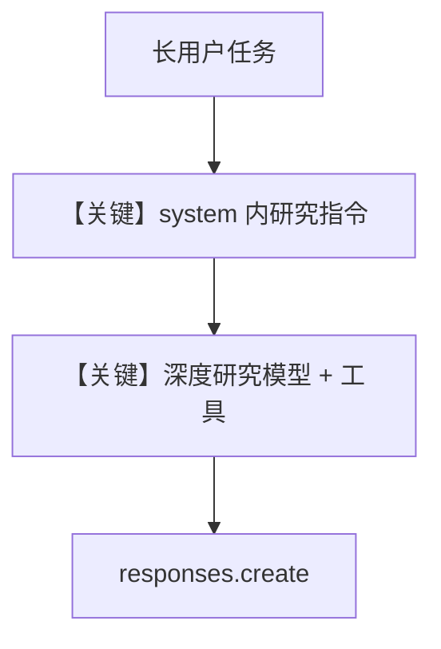

# deep_research_agent.py — 实现原理分析

<!-- cookbook-py-source:start -->
## 完整源码

```python
"""
Openai Deep Research Agent
==========================

Cookbook example for `openai/responses/deep_research_agent.py`.
"""

from textwrap import dedent

from agno.agent import Agent
from agno.models.openai import OpenAIResponses

# ---------------------------------------------------------------------------
# Create Agent
# ---------------------------------------------------------------------------

agent = Agent(
    model=OpenAIResponses(id="o4-mini-deep-research", max_tool_calls=1),
    instructions=dedent("""
        You are an expert research analyst with access to advanced research tools.

        When you are given a schema to use, pass it to the research tool as output_schema parameter to research tool.

        The research tool has two parameters:
        - instructions (str): The research topic/question
        - output_schema (dict, optional): A JSON schema for structured output
    """),
)

agent.print_response(
    """Research the economic impact of semaglutide on global healthcare systems.
    Do:
    - Include specific figures, trends, statistics, and measurable outcomes.
    - Prioritize reliable, up-to-date sources: peer-reviewed research, health
      organizations (e.g., WHO, CDC), regulatory agencies, or pharmaceutical
      earnings reports.
    - Include inline citations and return all source metadata.

    Be analytical, avoid generalities, and ensure that each section supports
    data-backed reasoning that could inform healthcare policy or financial modeling."""
)

# ---------------------------------------------------------------------------
# Run Agent
# ---------------------------------------------------------------------------

if __name__ == "__main__":
    pass
```

<!-- cookbook-py-source:end -->

> 源文件：`cookbook/90_models/openai/responses/deep_research_agent.py`

## 概述

本示例展示 Agno 的 **`OpenAIResponses` + `o4-mini-deep-research` + `max_tool_calls`** 机制：用长 `instructions` 引导模型使用内置深度研究能力，并限制单次 run 工具调用次数。

**核心配置一览：**

| 配置项 | 值 | 说明 |
|--------|------|------|
| `model` | `OpenAIResponses(id="o4-mini-deep-research", max_tool_calls=1)` | Responses；限制工具轮数 |
| `instructions` | `dedent("""...""")` | 多行研究指令 |

## 架构分层

```
用户代码层                agno.agent 层
┌──────────────────┐    ┌──────────────────────────────────┐
│ deep_research_   │───>│ instructions → get_system_message │
│ agent.py         │    │ 长用户任务 → get_run_messages      │
└──────────────────┘    └──────────────────────────────────┘
                                ▼
                        responses.create + 研究工具（模型侧）
```

## 核心组件解析

### max_tool_calls

限制 Agent/模型循环中工具调用次数，避免无限工具循环（具体实现见 Agent run 与模型配置）。

### 运行机制与因果链

1. **路径**：长用户消息（司美格鲁肽经济影响）→ system 中研究指令 → 模型调用研究类工具 → 返回带引用报告。
2. **状态**：无 `db`；单次 run。
3. **分支**：`max_tool_calls=1` 时工具链更短；增大则允许多步研究。
4. **定位**：展示 **深度研究模型 id** 与 **指令模板**，非普通 `gpt-4o` 聊天。

## System Prompt 组装

### 还原后的完整 System 文本（instructions 原样）

```text

        You are an expert research analyst with access to advanced research tools.

        When you are given a schema to use, pass it to the research tool as output_schema parameter to research tool.

        The research tool has two parameters:
        - instructions (str): The research topic/question
        - output_schema (dict, optional): A JSON schema for structured output
    
```

（前后空白以 `dedent` 为准；若与 `<instructions>` 标签合并，以 `get_system_message` 实际输出为准。）

## 完整 API 请求

```python
client.responses.create(
    model="o4-mini-deep-research",
    input=[...],
    max_tool_calls=1,  # 或等价请求字段，以 get_request_params 为准
)
```

## Mermaid 流程图



## 关键源码文件索引

| 文件 | 关键函数/类 | 作用 |
|------|------------|------|
| `agno/agent/_messages.py` | `get_system_message()` L106 | 拼装 instructions |
| `agno/models/openai/responses.py` | `invoke()` L671 | Responses |
